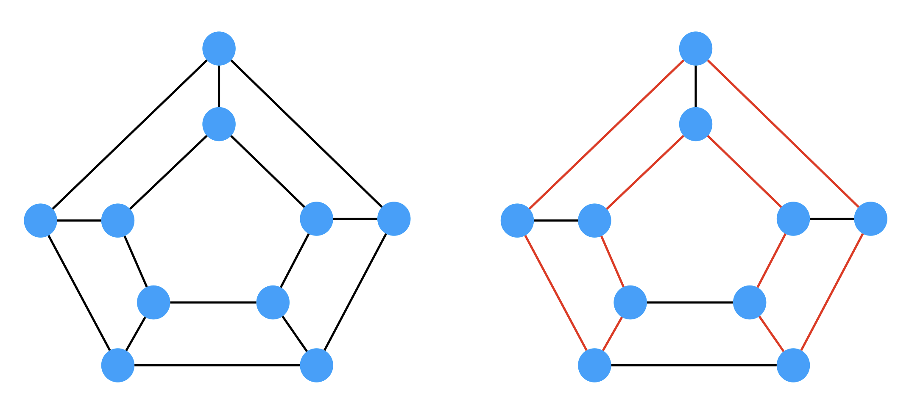
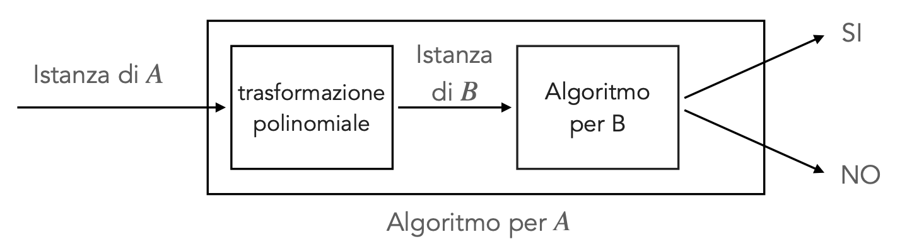
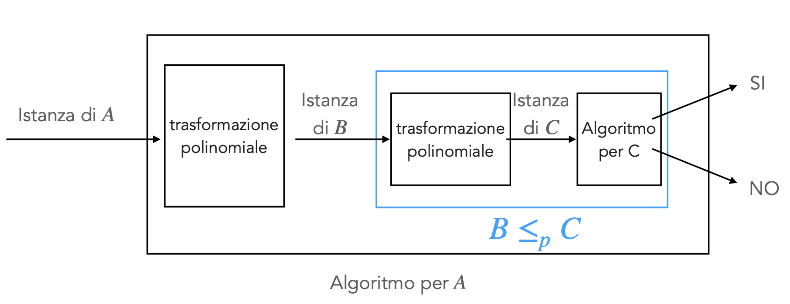
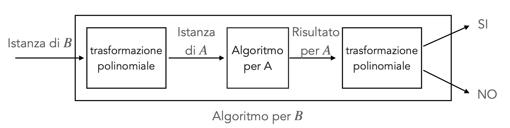
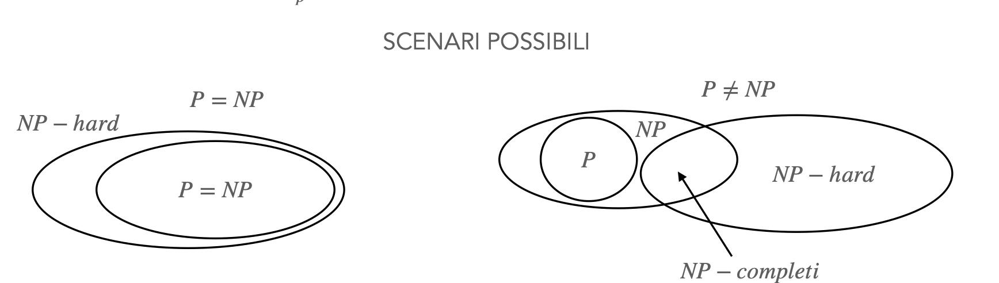
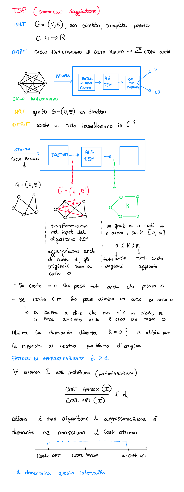
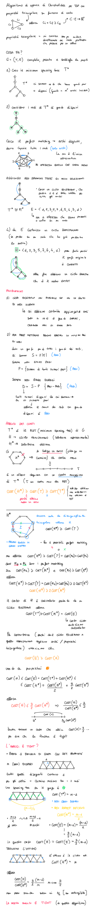

# Teoria della Complesità

## Problemi decisionali

> L'output di questi problemi è si o no (es. problemi del tipo, questo numero è primo?)

#### Esempio - Shortest Path

- Versione di ottimizzazione = dato un grafo $G = (V, E)$ e dei vertici $s, v \in V$ qual'è la lunghezza del cammino minimo tra $s$ e $v$?
- 

## Classi di problemi P

Problemi risolti con un algoritmo di costo polinomiale nella dimensione dell'input, finisce nella classe P. Trovare un algoritmo per il problema è sufficiente 

 

## P vs NP

ci sono problemi in $NP$ che sembrano più difficili dei problemi in $P$, sono i candidati per essere 

> Come caratteriziamo questi problemi?

---

**Definizione**: Riduzione di KRAP ($A \leq_{p} B$):
Un provlema decisionale $A$ è riconducibile in tempo polinomiale al problema decisione $B$ se:
- ogni istanza di $A$ può essere trasformata in tempo **polinomiale** in un'istanza di $B$
- ogni istanza positiva di $A$ viene trasformata in un'istanza positiva di $B$
- ogni istanza negativa di $A$ viene trasforamte in un'istanza negativa di $B$

> se voglio calcolare la mediana di un'insieme di valori disordinati, posso ordinare i numeri e prendere quelli in mezzo: uso il problema dell'ordinamento per risolvere quello della mediana

L'algoritmo di B quindi definisce se l'algoritmo è polinomiale o meno. La soluzione di B è sufficiente per risolvere il problema A.

Considerazioni, se $A\leq_pB$ e:
- $B \in P \Rightarrow A\in P$
- $A \notin P \Rightarrow B \notin P$
- $A \in P$ non si può dire niente sul problema $B$
- $B \notin P$ non si può dire niente sul problema $A$
- $B \leq_p A \Rightarrow A \equiv B$ i problemi sono equivalentemente difficili

**La riduzione polinomiale è TRANSITIVA**: $A \leq_p B \wedge B \leq_p C \Rightarrow A \leq_p C$

**Definizione - Classe di problemi NP-completi:**

un problema decisione $A$ è $NP$-completo se:
1. $A \in NP$
2. $ \forall B \in NP : B \leq_p A$

Per dimostrare che un problema $A$ è $NP$-completo sfruttiamo la transitività della riduzione:
1. dimostrare che $A$ è $NP$
2. scegliere un problema $B$ che è stato dimostrato essere $NP$-completo
3. dimostrare che $B\leq_p A$ 

> datp un qualunque altro problema $C \in NP$ abbiamo che $C \leq_p B$, abbiamo dimostrato che $B \leq_p A$, quindi valche che $C \leq_p A$ 

Tutto questo ha un inghippo: come è stato dimostrato che allora il problema B è NP-completo? c'è stato un altro problema che prima per transitività è stato dimostrato essere NP-completo. Seguendo la catena come è stato dimostrato il primo problema? 

> Teoremi di Cook (1971) e Levin (1973) hanno dimostrato l’esistenza di un primo problema NP-completo (SAT)

**TEOREMA**
1. Se si dimostra che per un problema NP-completo esiste un algoritmo di costo polinomiale, allora $P = NP$
2. Se si dimostra che per un problema NP-completo non esistono algoritmi di costo polinomiale, allora $P \neq NP$

esistono problemi per i quali non è scontato neanche verificare una soluzione (di base non decisionali, spesso di ottimizzazione)

Esempio - Problema del commesso Viaggiatore (TSP)
Input: grafo completo con archi pesati
Output: ciclo hamiltoniano di costo minimo (costo = somma archi)

Dati un’istanza del problema (grafo) e una “presunta" soluzione (ciclo hamiltoniano), come verificare che sia effettivamente la soluzione ammissibile ottima?

**Definizione - Clases di problemi NP-Hard:**

Un problema $A$ è NP-hard se: $\forall B \in NP: B \leq_p A$

> l'algoritmo per $A$ definisce il costo per tutto il problema

Per dimostrare che un problema $A$ è NP-hard sfruttiamo la transitività della riduzione:
1. scelgiere un problema $B$ che è stato essere NP-completo
2. Dimostrare che $B \leq_p A$

Molti problemi di ottimizzazione NP-hard hanno importanti applicazioni e non possono essere ignorati

**possibili soluzioni:**
- Risolvere efficientemente questi problemi solo per istanze piccole
- Utilizzare euristiche
- Utilizzare algoritmi paralleli e/o distribuiti
- Utilizzare algoritmi di APPROSSIMAZIONE $\rightarrow$ Algoritmi che restituiscono, in tempo polinomiale, una soluzione ammissibile, non necessariamente ottima, ma con garanzie sul discostamento dal costo della soluzione ottima.

> differenza tra algoritmo di approssimazione e una euristica è che con il primo hai delle garanzie, hai un upperbound nel costo.

#todo: dimostrazione per riduzione dell'algoritmo del commesso viaggiatore

---

## Esempi di algoritmi di Approssimazione

### Algoritmo di approssimazione di Christofides

### Vertex Cover