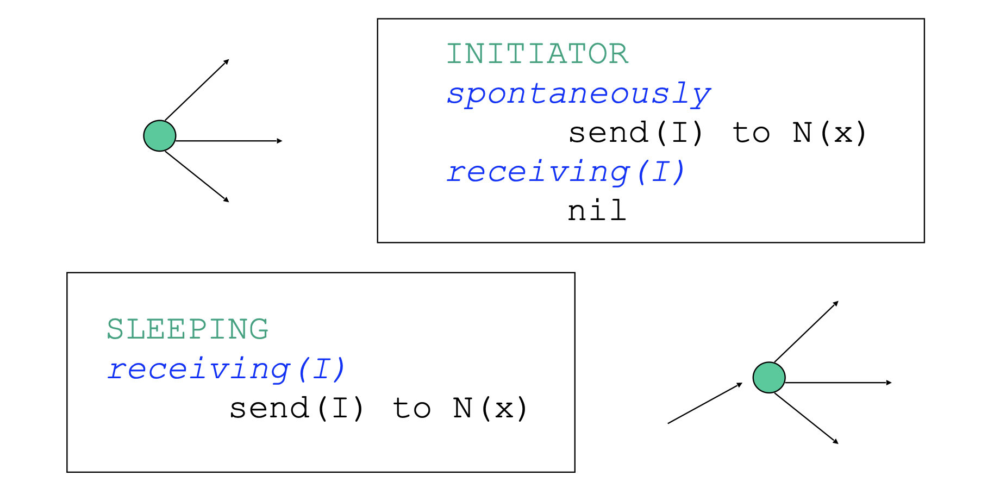
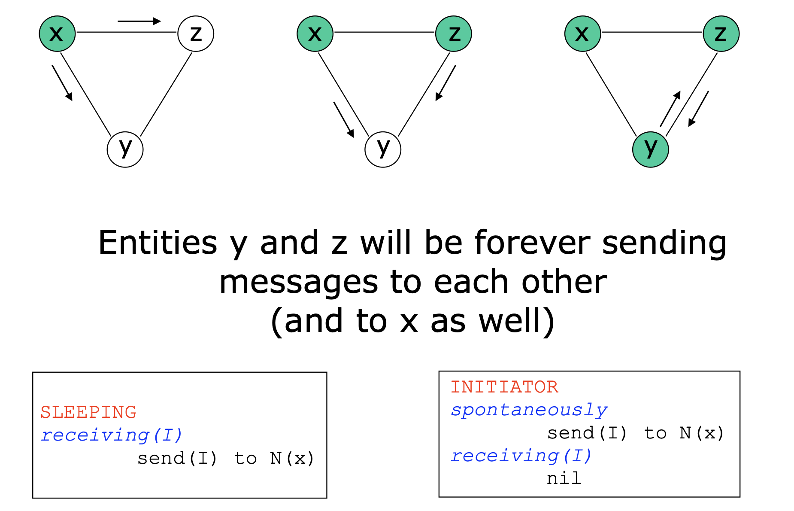
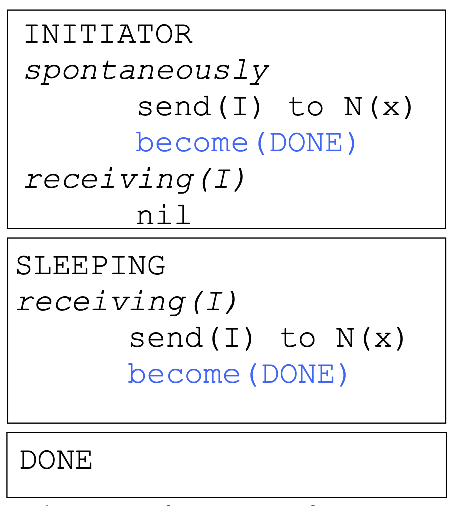
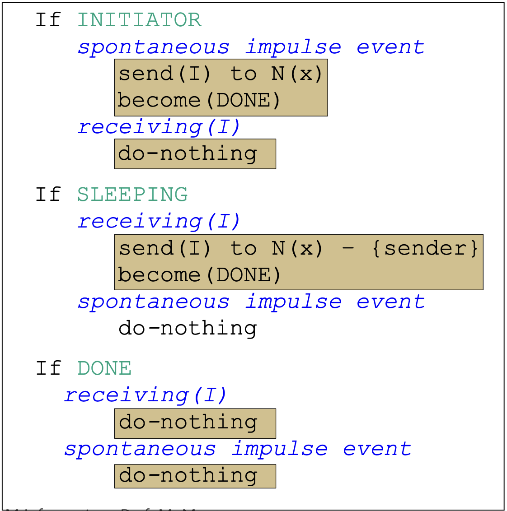
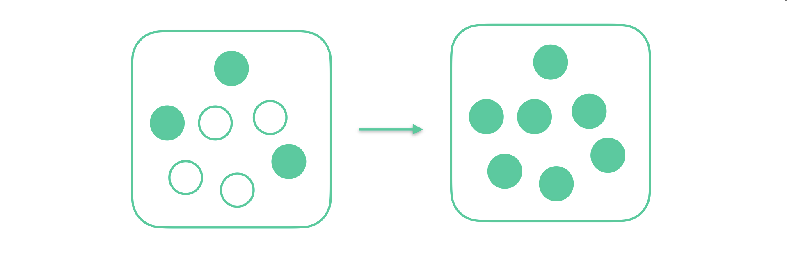
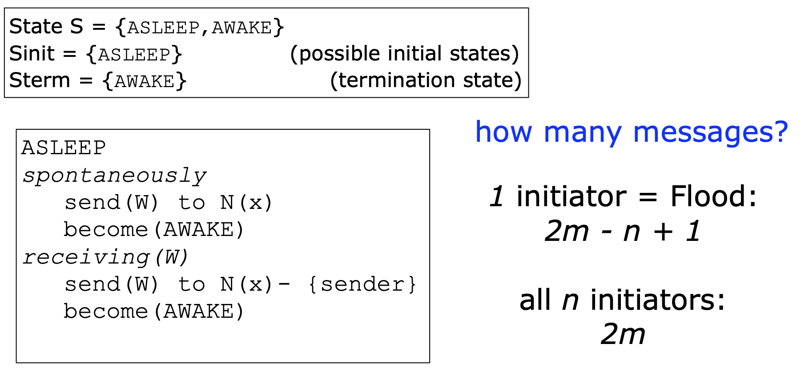

# Theory of Distributed Computing

## Introduzione

I sistemi distribuiti sono nati quasi per caso, negli anni 80' c'era molta ricerca sulle macchine parallele. Non avevano delle macchine parallele, ma si sono trovati ad avere tante macchine in giro che potevano parlare perchè collegate a reti. Si sono trovati invece con macchine eterogenee e collegate con topologie "strane". 

> Distributed environments: una collezzione finita di entità che comunicano per poter achraggiungere un obiettivo comune 

per risolvere il problema dobbiamo scoprire un algoritmo distribuito per queste entità. Come negli algoritmi tradizionali voglio **correttezza** ed **efficienza**. Dal punto di vista astratto non cambia niente, cambia l'esecutore, ciò che sta sotto.

#### Perchè?

- si riescono a rendere **disponibili molte risorse** (che siano stampanti, file collegati)
- Posso essere più **tollerante ai guasti** (avendone tanti non sono dipendente totalmente da essi)
- **Scalabilità**: se ho un sistema con tante entità, se aumento il numero di esecutori, posso, magari, risolvere problemi più grandi.

#### Contesti

È sicuramente diverso da un singolo processore, ma anche da un sistema parallelo.

- in un sistema distribuito non si può assume che le macchine siano tutte uguali,
- nel sistema distribuito non abbiamo memoria condivisa, a differenza delle macchine parallele (alcune possono avere gerarchie di memoria, ma comunque hanno una SHEM)
- in un sistema distribuito le distanze tra gli agenti possono essere arbitrariamente grandi, si devono considerare i problemi di comunicazione

La differenza sta in come si risove il problema:
- in una macchina parallela si scompone un problema e parallelamente si risolvono piccoli problemi per poi ricomporre le soluzioni assieme per avere il risultato finale. (es. tiling per matrici)
- in un contesto distribuito tutti collaborano per risolvere il problema.

### il nostro contesto

- Entità: ciò che è capace di fare computazione, possono essere tutte diverse
  - sono autonome: hanno clock differenti, la loro memoria privata
  - Interagiscono tramite scambi di messaggi
- Modello: le nostre entità possono comunicare solo con determinate altre entità, dipendentemente da come è collegata la rete:
  - il network è una specie di grafo, dove i nodi sono le entità e gli archi sono i link che permettono di comunicare

Quello che definisce i nostri problemi nel nostro contesto abbiamo che, ogni entità abbia il proprio input, e lo stesso output.
Tutte le entità hanno lo stesso codice, lo stesso algoritmo, questo non obbliga tutte le entità ad eseguire lo stesso flusso del codice. 

### Come si descrive l'algoritmo

- ogni enttità ha uno stato appartenente a un set di stati $S$ finiti. (ex: $S : \{idle, computing, wating, processing, ...\}$)
  - possono essere in un solo stato alla volta
- quello che fa eseguire determinate azioni sono chiamati **eventi** 
  - sostanzialmente reagisce agli eventi:
    - tick del clock
    - la ricezione di un messaggio da parte di un vicino
    - un evento esterno al sistema: per esempio la richeista di un prelievo da un bancomat
- nel momento in cui arriva un evento la nostra entità esegue delle attività, un insieme di attività definisce una **azione**:
  - una sequenza di attività crea l'azione
  - termina in tempo finito e le azioni sono atomiche, le attività non possono essere interrotte

Le azioni che deve compiere una entità quindi dipendono dall'evento e dal loro stato
$$
Status\space x \space Event \rightarrow Action
$$

possiamo descrivere il nostro agloritmo risolutore come una serie di regole, e devono essere simmetriche (uguali per tutti): se tutte le attività hanno lo stesso comportamento
$$
B(x) = B(y)\space \forall x,y \in E
$$

#### Comunicazione

parlando di sistemi distribuiti dal punto di vista teorico si pensa come se ci fosse una rete sotto e comunicano tramite questa rete. le entità ricevono e mandano i messaggi, non necessariamente tutti sono collegati, c'è una rete che decide chi comunica con chi, dipende anche dal canale di comuinicazione (unidirezionali, bidirezionali).
Nel caso avessimo una topologia di grafo diretto, gli archi uscenti rappresentano verso chi il nodo può comunicare, viceversa per gli archi entranti.

### Assiomi

> ci sono degli assiomi

#### Tempo finito

Se tutto funziona, se un messaggio parte da un nodo, prima o poi, il messaggio arriva a destinazione (ma in un tempo finito)

#### orientamento locale

Ogni entità è capace di distriguere i vicini: sostanzialmente i nodi sono capaci di mandare il messaggio a uno specifico vicino, e viceversa per ricevere un messaggio, sanno da chi gli è arrivato.

Sostanzialmente ogni entità è in grado di conoscere/distinguere i suoi vicini prossimi, non c'è assunzione su quella che è la conoscenza del resto della rete. 

---
Questi assiomi li consideriremo sempre, esistono però dei casi con ipotesi aggiuntive per avere soluzioni differenti, più interessanti. Queste però sono dei limiti che si applicano al problema, queste devono essere esplicite.

#### Esempi di Tipi di restrizioni

- Comunicazione
  - Assumiamo che il link di comunicazione sia FIFO, i messaggi arrivano nell'ordine in cui sono stati inviati.
  - I link sono unidirezionali o bidirezionali
- Possibili Fallimenti (essendoci tante entità possono fallire alcuni dei componenti in gioco), ovvero quanto posso continuare a lavorare dopo un fallimento, o cosa posso fare se mi fallisce un determinato link o nodo:
  -  avere un failure detector: ovvero entità che sono in grado di avvisare altri che qualcuno è fallito
  - Che cosa può andare bene o male, questo va descritto: 
     -  Guaranteed delivery: il contenuto del messaggio, questo arriva esattamente come era partito.
     -  Partial Reliability: può esserci stato un fallimento in passato, ma non ci saranno da qui in poi
     -  Total Reliability: funziona tutto sempre benissimo, senza fallimenti
-  Topologia della rete di comunicazione:
   -  per esempio relativo alla connettività (es. fortemente connesso)
      -  Restrizioni sulla tipologia del grafo
      -  Conoscienze sulla topologia, tipo sul numero di nodi, link ecc...
-  Tempo
   -  il tempo di comunicazione abbia un upperbound (arriva entro un $\Delta$, se non ci sono fallimenti)
   -  tutti i clock siano sincronizzati
   -  in assenza di fallimenti il delay di comunicazione è unitario

### Time and Space Complexity

> efficienza, come al solito vogliamo minimizzare le risorse

Con gli algoritmi classici avevamo:
- Tempo: in numero di operazioni
- Spazio: in funzione della dimensione dell'input

Negli algoritmi distribuiti, ci interessa ancora il tempo, ma bisogna capire come misurarlo; lo spazio di memoria che utilizza ogni singola entità è poco interessante, non misuriamo più lo spazio come lo spazio di memoria necessario, ma ci occupiamo di un altro aspetto del sistema: la comunicazione, quanto si parlano, perchè è una azione dispendiosa, utilizzano risorse, banda, batteria.

Le cose che si misurano per determinare l'efficienza di un algoritmo distribuito:
- Comunicazione: numero di messaggi scambiati in totale durante l'esecuzione dell'algoritmo, nel caso peggiore.
  - diverse granularità: es. il numero di messaggi o il numero di bit che si trasmettono (nel caso non siano tutti uguali i messaggi o siano di diverse dimensioni).
- Tempo: o mi metto in un caso in cui i messaggi arrivano in una unità di tempo, e così posso contare le unità di tempo; oppure se questa cosa è irrealistica devo comunque trovare un modo per capire se ci mette tanto o poco
  - i messaggi che viaggiano possono essere indipendenti tra di loro, ma altri messaggi possono avere una conseguenza di causa, uno è partito perchè prima gli è arrivato un messaggio. Fondamentalmente ho delle catene di messaggi, (perchè uno parte per coseguenza dell'arrivo di un altro) che per forza hanno un ordine. Allora conto la più lunga catena di messaggi (es. 10 messaggi uno dopo l'altro)

> Quando misuro il tempo trascuro completamente il tempo computazionale della singola entità, questo tempo viene incluso nel tempo del messaggio oppure la computazione locale è trascurabile (perchè piccola) rispetto al tempo necessario per inviare il messaggio.

Posso avere due casi (dove conto il tempo):
- caso sincrono, in cui assumiamo la time complexity ideale (messaggi in una unità di tempo e con clock sincronizzato)
  - si va avanti ad unità di tempo = messaggi scambiati
- Asincrono, dove può accadere qualsiasi cosa, non c'è nessun sincronismo tra le entità, e per contare il tempo devo contare la catena più lunga di messaggi

## Problema del Broadcast

Una entità ha una informazione che vuole comunicare con tutti gli altri. Lo stato finale in cui mi voglio trovare: tutti sanno l'informazione. 

La soluzione deve essere generale:
- funzinoare su tutte le tipologie
- il nodo di partenza non deve essere fisso
- per qualunque numero di entità

**Restrizioni**
- un iniziatore unico (all'inizio solo uno vuole inviare il messaggio)
- total reliability: non ci sono fallimenti
- link bidirezionali
- il grafo è totalmente connesso

### Prima idea

se una entità conosce qualcosa, la manda a tutti i suoi vicini.
- una entità è un INIZIATORE, le altre sono SLEEPING
- Stati: $S = \{INITATIOR, SLEEPING\}$
- Informazione: $I$
- il set di azioni fi $B(E)$ sono:

> qual'è il problema di questo metodo?

c'è un loop.

come risolvo questo problema?

### Seconda Idea
Aggiungo uno stato $DONE$ allora $$S = \{ INITIATOR, SLEEPING, DONE \}$$

Avendo già in mente che so che poi dovrò andare a misurare il numero di messaggi che si scambiano, sono tutti necessari? ci sono messaggi che posso non inviare?

### Protocol Flooding - Terza idea

se una entità conosce qualcosa, la manda a tutti i vicini eccetto al mittente del messaggio.

**Osservazioni:**
- Le entità terminano la computazione in momenti differenti, c'è una **local termination** ma non una **global termination**
- Nessuna entità sa quanto l'intero processo termina (questo problema è chiamtao **termination detection problem**)
  
### Correttezza

- Dobbiamo provare che tutti ricevono il messaggio: questo è vero perchè siamo in un contesto di Total Reliability, quindi senza fallimento e il grafo è totalmente connesso (in un grafo totalmente connesso data una coppia di nodi esiste almeno un cammino disponibile)
- Termina: sì perchè se tutti i ricevono il messaggio, tutti termineranno (una singola entità termina quando riceve il messaggio)

### Costo

Come contiamo il numero di messaggi: la scriviamo come una funzione in base alla dimensione dell'input:
- $n$: numero di entità (nodi)
- $m$: nuemero dei link (archi)

> Il conto dei messaggi non è scontato, perchè devo considerare l'interezza del grafo

Messaggi:
- se io penso agli archi, durante l'esecuzione al massimo ci passano al massimo 2 messaggi
  - se ho $m$ messaggi allora so che $\leq 2m$ allora che $O(m)$

possiamo contare più precisamente, se li conto dal punto di vista del nodo:
- iniziatore ne manda tanti quanti sono i suoi vicini
- uno che non è iniziatore, ne manda tanti quanti sono i suoi vicini - 1

Consideriamo $s$ come l'iniziatore:
$$
|N(s)| + \sum_{x \neq s}(|N(x)| - 1) = \sum_x |N(x)| - \sum_{x \neq s} 1 = 2m  - (n-1) 
$$
dove $N(x)$ è il numero di vicini di un determinato nodo

#### Tempo

Se in una unità di tempo i messaggi arrivano in una unità di tempo, in questo caso stiamo seguendo un percorso preciso, visto che i vicini mandano ai vicini e così via, stiamo facendo una BFS, fino ad arrivare alla profondità dell'albero.
Se io ho una sorgente quello che devo pagare è la lunghezza del cammino al nodo più lontano rispetto alla sorgente, ma non ho la sorgente fissa, considero quindi il caso peggiore. Considero quindi il diametro del grafo.

> Diametro del grafo: la più grande distanza che c'è tra due nodi del grafo, la distanza è il cammino più breve che li collega

$$
r(\text{initiator}) = Max_y\{d(\text{initiator}, y)\} \space \forall \text{ entity } y
$$

ogni nodo può essere l'iniziatore

$$
Max_{(x,y)}\{d(x,y)\} = Max\{r(x)\} = D(G)
$$

dove 
- $D(G)$ è il diametro del grafo
- $r(x)$ è il raggio: Massima distanza di una enttità $x$ da ogni altra entità
- la distanza $d(x,y)$ è il minimo numero di edge lungo il path da $x$ a $y$

ho quindi come upperbound il diametro del grafo, questo non può essere maggiore di $n-1$

$$
\text{Number of Time Units} \leq D(G) \leq n-1 \in O(n)
$$

Anche perchè se ci immaginiamo (nel caso peggiore) dove il grafo è una catena, per completare l'algoritmo dovrà metterci $n-1$ messaggi.

**Ma è possibile fare di meglio?**

Vediamo se il problema può ammettere soluzioni migliori, cerchiamo quindi un **lower bound**. 

> Se il lowerbound = upperbound allora ho trovato la soluzione migliore

Pensiamo al tempo: nel caso ideale, cosa vuol dire ridurre il tempo, ovvero fare qualcosa di meno del diametro del grafo.

Questo però non è possibile perchè il diametro del grafo prende una coppia di nodi più lontani tra di loro, ma il diametro è anche il cammino più breve tra questi due nodi. Se faccio di meno di questo vuol dire che sto sbagliando, perchè non sto completando il cammino del diametro. (Stessa cosa nel caso più complicato)

$$
Time(Broadcast(G)) \geq Max:{(x,y)}\{d(x,y)\} = D(G)
$$

**Possiamo diminuire il numero di messaggi?**

Nel problema del broadcast voglio che ogni nodo riceva il messaggio. Quindi per risolvere il problema devo inviare $n-1$ messaggi (perchè con $n$ nodi uno è l'iniziatore, a cui non serve il messaggio)

$$
Message(Brodcast(G)) \geq n-1 \in \Omega(n)
$$

Questo è un lowerbound un po' troppo semplice, perchè è poco. 
Controlliamo quello che succede su gli archi:
- Se faccio qualcosa che dipende da $n-1$, probabilmente gli archi sono di più dei nodi, quindi vuol dire che qualche arco lo stiamo saltando.
  - Se ho già ricevuto un messaggio da un arco, devo per forza inviare su tutti gli archi dei miei vicini il messaggio

Questo ci porta a dire che su un arco deve passare **almeno 1 messaggio**. 

$$
Message(Broadcast(G)) \geq m \in \Omega(m)
$$

e

$$
Message(Broadcast(G)) \leq Message(Flooding(G)) = 2m - n + 1
$$

il problema come upper bound ha l'algoritmo di Flooding. Un protocollo che migliorerebbe Flooding deve ridurre di 2 la costante.

**Possiamo fare meglio con topologie specifiche?**

Assumiamo che il grafo $G$ sia invece un albero $T$, allora il numero di archi diventa $m = n-1$

$$
Message(Flooding(T)) = 2m + n + 1 \\
\quad\quad\quad\quad\quad\quad\quad\quad\quad\quad\quad\quad\space\space\space= 2(n-1) - n + 1\\
\quad\quad\quad\quad\quad\quad\quad\quad= n -1 \\
\quad\quad\quad\quad\space\space\quad\quad= m
$$

L'algoritmo Flooding su un albero è ottimo nel numero di messaggi scambiati e funziona anche se le entità non sanno che il network è un albero.

---

Assumiamo invece che $G$ sia un grafo completo non diretto, questo vuol dire che abbiamo $m = n(n-1)/2$ archi. quindi tecnicamente il costo con Flooding diventa
$$
Message(Flooding(G)) \in O(n^2)
$$

Otteniamo quindi un costo quadratico, questo arriva dal fatto che tutti i nodi ricevono il messaggio alla prima iterazione, ma continuano a inviarselo a vicenda non conoscendo la topologia del grafo.

Se le nostre entità sanno di essere su un grafo completo, invece che usare Flooding possono fare qualcosa di meglio e di molto più semplice: l'iniziatore manda a tutti quanti e STOP. 

$$
Message(SimpleBroadcast(G)) = n - 1    \\
Time(SimpleBroadcast(G)) = D(G) = 1
$$

> Questo funziona solo su grafi completi

---

Quindi se sono su un grafo qualunque, generico, non un albero non un grafo completo, Flooding funziona bene? Funziona bene solo su albero.

Allora in generale prima di fare broadcast creo uno spanning tree e poi invio i messaggi sui link dello spanning tree appena creato. Oltretutto se pensiamo che magari c'è un programma che ha bisogno di molti broadcats (anche da iniziatori differenti) riutilizzo sempre lo stesso Spanning Tree, quindi il costo di costruzione dell'albero viene ammortizzato con il tempo.

## Wake-up Problem

Quando devo far partire un protocollo, almeno una entità deve essere svveglia, in modo che uno possa lavorare.
**Problema**: siamo in un contesto in cui alcuni nodi sono attivi e stanno lavorando, e altri sono addormentati e devono essere svegliati

Una idea è quella di utilizzare il Broadcast, gli iniziatori sono i nodi svegli, e il messaggio è uno di wake-up per i dormienti

Se abbiamo $k$ svegli all'inizio (che non sono tutti): abbiamo gli iniziatori che lo mandano a tutti i vicini, più tutti i vicini - 1; viene fuori che abbiamo 
$$
2m - (n - k) = 2m - n + k
$$
Nel caso del tempo, devo guardare sempre il caso peggiore (ovvero quando c'è un solo iniziatore), ottengo lo stesso identico caso del flooding, quindi 
$$
O(D)
$$
