# Spanning Tree Construction


Uno spanning tree $T$ di un grafo $G = (V,E)$ è un sottografo di $G$ aciclico tale che $T = (V,E')$ e $E' \subseteq E$

**Restrizioni**:
- Iniziatore Singolo
- Link Bidirezionali
- Total Reliability
- G è connesso
  
## Protocol SHOUT

Dobbiamo vedere il problema dal punto di vista del singolo nodo, ovvero ogni nodo non deve costruire lo spanning tree, alla fine deve sapere quali sono i nodi che rimangono vicini anche nello spanning tree.
$$
\forall x, \space \text{Tree-neighbors}(x) = \{\text{neighbours in the spanning tree}\}
$$

1. l'iniziatore manda un messaggio ai vicini per capire quale tra i vicini nel grafo saranno i suoi vicini nello spanning tree
2. Se un nodo riceve questo messaggio risponderà sì se non è vicino di nessuno, se invece ha già ricevuto un messaggio allora risponderà no.

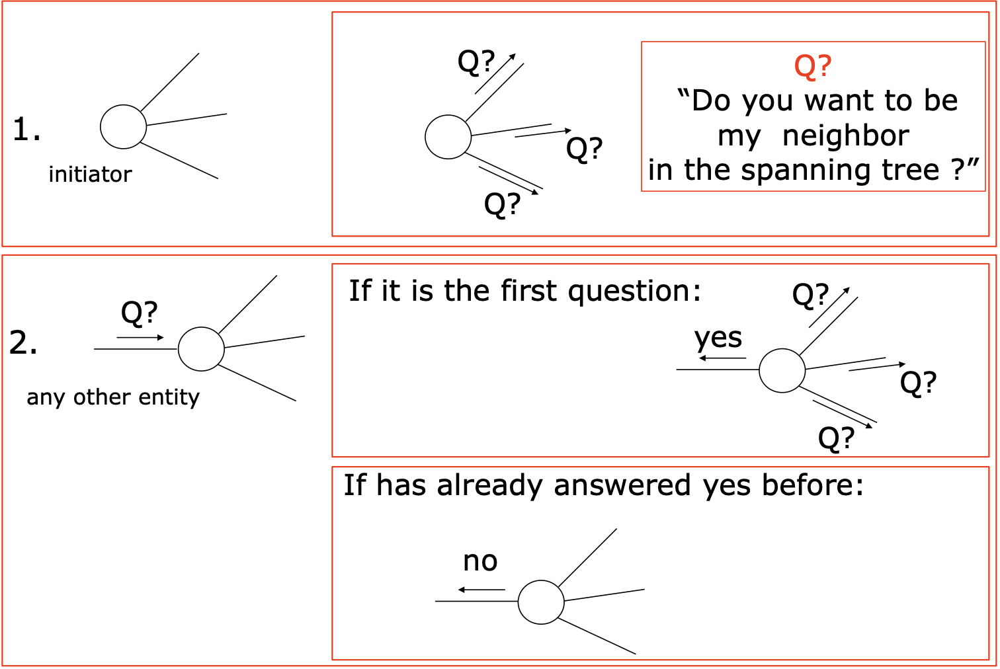


> non posso rispondere due volte sì perchè si creerebbe un ciclo che in un albero non è ammesso

Quando un nodo risponde sì allora quell'archo diventa anche un arco dello spanning tree. Alla fine gli archi dello spanning tree saranno tutti quegli archi su cui è passato una risposta positiva. Nessun nodo quindi conosce tutto l'albero.

Un nodo termina la sua computazione quando tutti i suoi vicini gli hanno risposto (otterrà tante risposte quanti sono i vicini). Nessun nodo sà quando tutto l'algoritmo termina.

```
State S = {INITIATIOR, IDLE, ACTIVE, DONE}
Sinit = {INITIATIOR, IDLE}
Sterm = {DONE}
```

<div style="display: flex; justify-content: space-around;">
    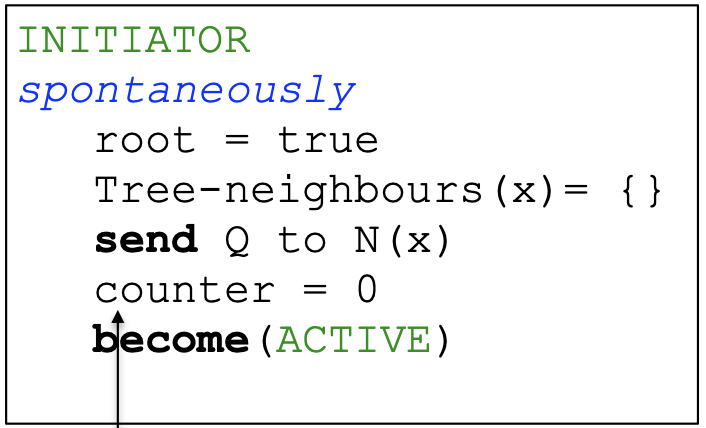
    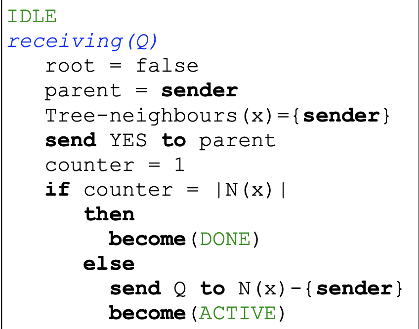
    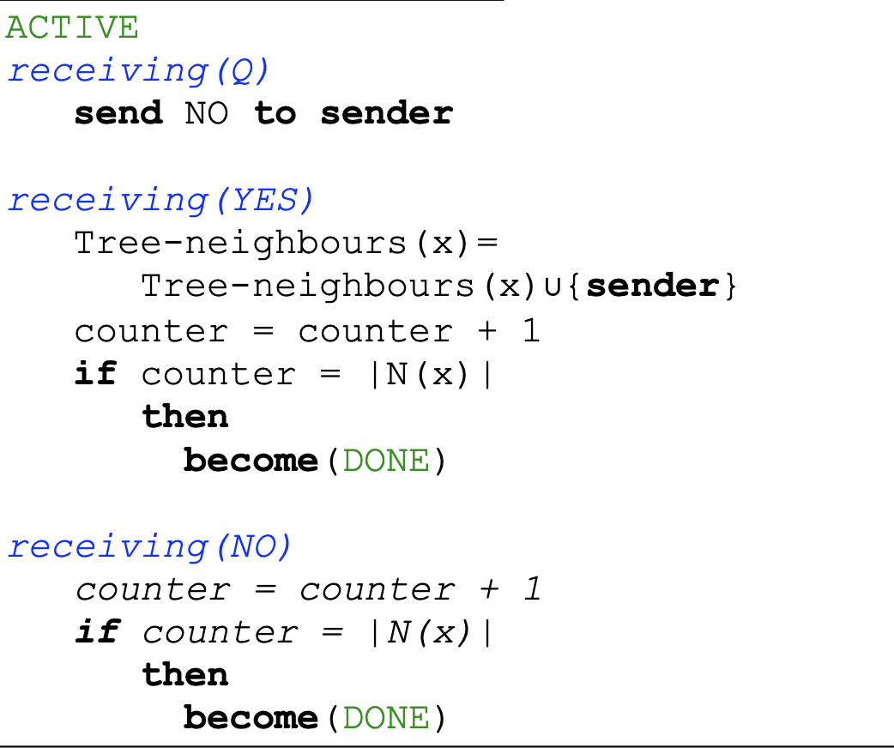
</div>

#### Correttezza

Qui ogni nodo decide chi sarà il suo vicino nello spanning tree in maniera autonoma, la decisione fra i due vicini nello spanning tree deve essere coerente tra i vari nodi. Quindi dato un arco entrambi i nodi alla fine dell'arco diventano vicini poichè da un lato è stata mandata una Q, mentre dall'altro è stata mandata una YES.

> C'è quindi coerenza tra i nodi

Tutti quanti i nodi vengono raggiunti, perchè fondamentalmente stiamo utilizzando flooding con delle risposte e domande. Questo crea anche un albero corretto poichè ogni nodo ha solamente un padre, questo garantisce che il grafo finale sia realmente un albero.

Nessuno si accorge quando l'algoritmo finisce, si sà però che prima o poi tutti i quanti nodi verranno raggiunti e quindi finiranno. Non sappiamo in quanto tempo, ma rimane un tempo **finito**

### Costo

**Messaggi**

Questo sembra un fooding dove abbiamo una risposta per ogni messaggi, ci aspettiamo che il costo dei messaggi sia il doppio, ovvero
$$
Message(Shout) = 2 \times Message(FLOODING)
$$

Un modo per contare i messaggi è quello di vedere cosa succede su un arco, vedere i vari tipi di messaggi che possono passare per poi contarli.

Abbiamo 3 tipi di messaggi: Q, YES, NO. 


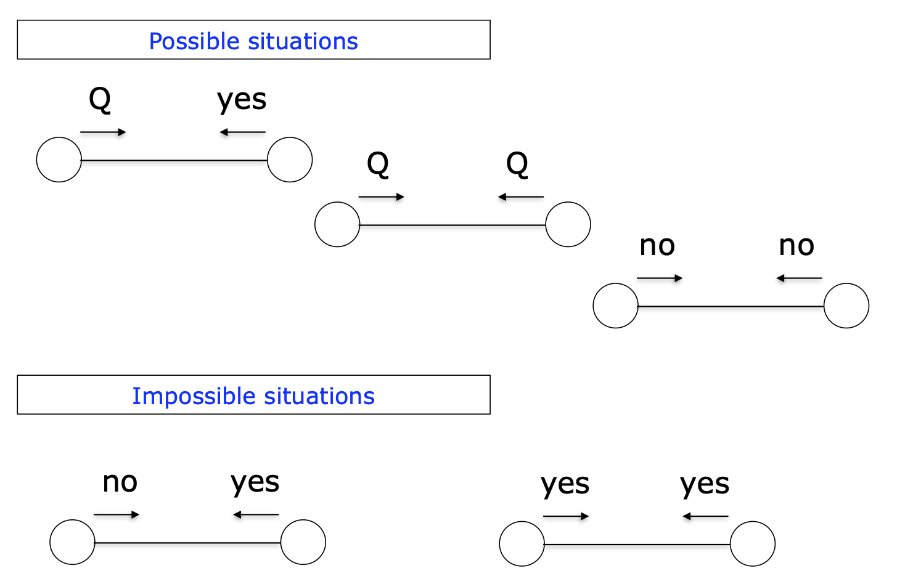

Ora contiamo quante volte possono accedere questo tipo di situazioni possibili. contiamo il tipo di messaggi che possono passare:
- L'interazione Q-YES compare esattamente $n-1$ volte, poichè è quella che genera la relazione Padre-Figlio, e capita una sola volta per nodo
- L'interazione Q-Q compare esattamente $2[m - (n-1)]$ volte, poichè saranno tutti gli archi che non compaiono nello spanning tree, siccome ho 2 Q moltiplico tutto per 2.
- L'interazione NO-NO compare esattamente $2[m - (n-1)]$ perchè compariranno dopo l'inetazione Q-Q
  
Alla fine sommando tutto otteniamo:
$$
Message(SHOUT) = 2m - n + 1 + 2[m -(n-1)] + (n-1) \\
= 4m -2n +2 \\
= 2(2m-n+1) = 2Message(FLOODING)
$$

C'è un modo per ridurre il numero di messaggi? Sì se ci troviamo nella situazione Q-Q, so sicuramente che la prossima situazione sarà NO-NO, quindi possiamo evitare lo scambio di questi messaggi.

#### Protocol Shout +
Cambia lo stato Attivo

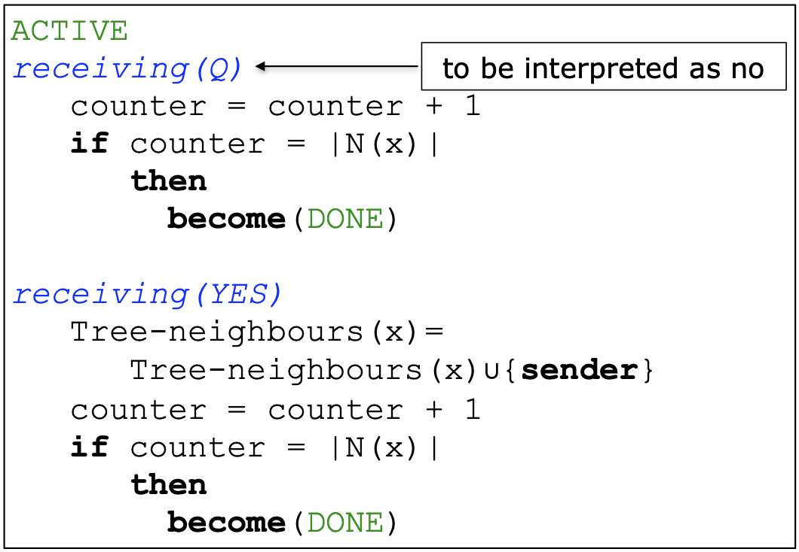

ci troviamo allora in questa situazione

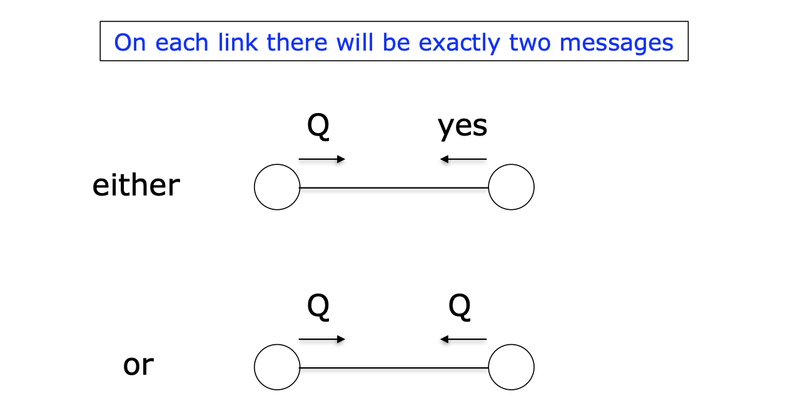

Questo porta il costo dei messaggi a 2 su ogni arco, ovvero
$$
Message(SHOUT+) =  2m < 2(2m -n+1) = Message(SHOUT)
$$

---

Se abbiamo più iniziatori (es. 2) il protocollo funziona ma ottengo 2 spanning tree

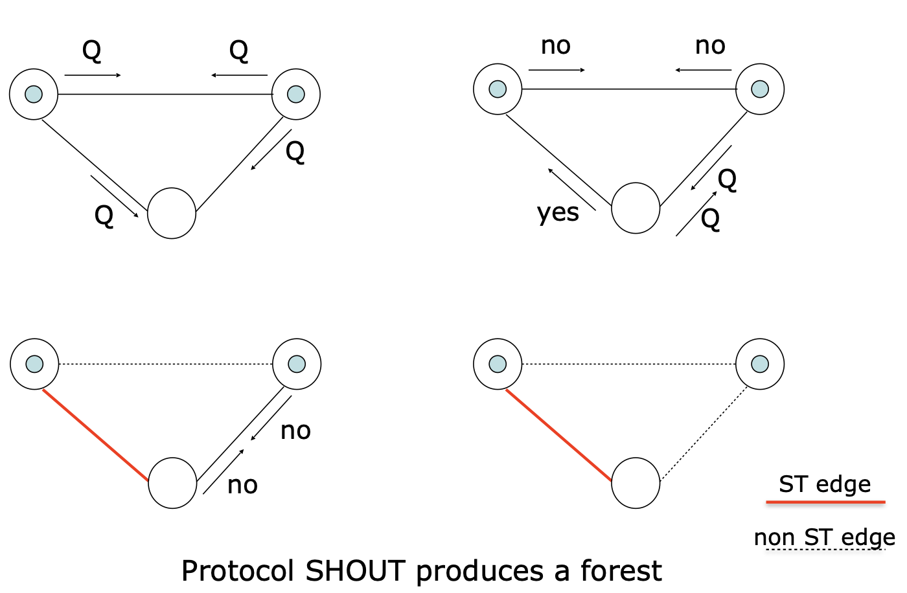

La computazione termina, arrivano a tutti a terminazione, ma si è formato un albero (in questo caso) con due nodi, e dall'altra parte un albero composto da un nodo. Questo ovviamente accade anche con grafi molto più grandi.

> BFS: restituisce un alberlo tipicamente Largo e Corto 
> DFS: restituisce un alberto tipicamente Stretto e Profondo

L'albero che può venire fuori, se tutti i messaggi sono in sincrono, è uno simile a quello costruito tramite BFS. Se mi metto in una situazione asincrona, non è più detto (dipende da come viaggiano i messaggi).
Questo albero però viene costruito in "parallelo" (non come una macchina parallela). 

Ci sono casi in cui, anche in un sistema distribuito, voglio che si lavori in maniera sequenziale, come nella costruzione **by Traversal**

## Spanning Tree Construction By Traversal (Traversal Protocol)

Uno spanning tree può essere costruito tramite l'attraversamento del grafo (andare a visitare un nodo alla volta, stile DFS)

In questo caso, nei sistemi distribuiti, partendo dall'iniziatore si utilizza un messaggio speciale (**token**) e si raggiunge ogni entità sequenzialmente. una volta che una entità riceve il token è considerata visitata.

> Questo crea uno spanning tree DFS a partire dal grafo

**Restrizioni** (sono le stesse):
- Iniziatore Singolo
- Link Bidirezionali
- Total Reliability
- G è connesso


Solitamente le visite DEPTH-FIRST funzionavano ricorsivamente, devo simulare queste chiamate ricorsive anche in un ambiente distribuito. Invece di avere una chiamata ricorsiva, si manda un messaggio che dice "fai tu quello che dovevo fare io (una chiamata ricorsiva) e poi fammi sapere il risultato".

Abbiamo un token che viene passato tra i nodi, determina quale delle entità sta facendo qualcosa in quel momento, le altre stanno aspettando. Ne abbiamo di tre tipi:
- **Forward Token**: utilizzato per scoprire un nuovo vicino, vado a chiedere al mio vicino di continuare la visita in profondità
- **Return Token**: rimandato indietro dal vicino per dirmi che ha finito
- **Back-edge Token**: quello che identifica la presenza di un ciclo (mi collega un discendente a un padre)

immaginamo di essere in un nodo qualunque:
1. Quando ricevo il Forward Token per la prima volta:
   1. sono entrato nell'albero, sono stato visitato, devo continuare la visita in profondità
   2. Mi ricordo chi mi ha mandato il Forward Token
   3. Mando il Forward Token a UNO dei vicini
   4. aspetto che il token mi ritorni
2. Se aspetto, a un certo punto ricevo un token:
   1. Se ricevo un Return Token
      1. se ho ancora dei vicini non visitati, devo mandare il Forward Token ad un altro vicino, e aspetto nuovamente il ritorno
      2. Se non ho più vicini da esplorare, io ho finito la visita dei miei vicini, allora mando un Return Token a chi mi aveva inviato inizialmente il Forward Token
   2. Se ricevo un Forward Token
      1. mando al mittente un Back-edge Token, che vuol dire che quell'arco lì non devo continuare ad esplorare. 
      2. Segno come visitato il nodo (che era un mio vicino se mi ha mandato un messaggio)
   3. Se ricevo un Back-edge Token
      1. ho scoperto che da quel vicino non posso più andare avanti, quindi se ho altri vicini provo con loro, altrimenti mando un Return Token

<div style="display: flex; justify-content: space-around;">
    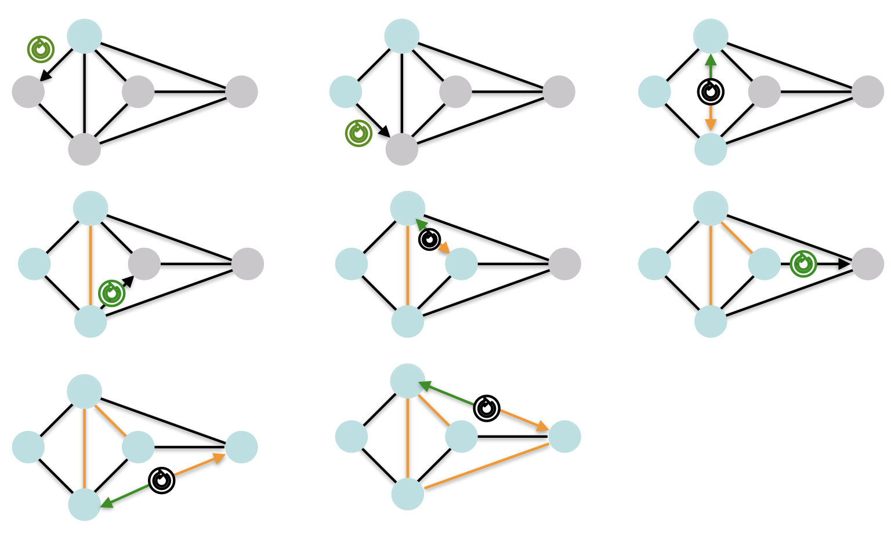
    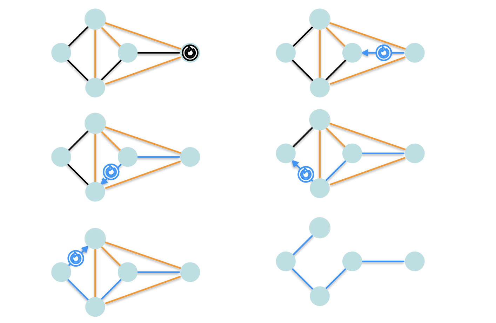
</div>


> Alla fine il mio spanning tree è composto da tutti gli archi dove sono passati i Forward-Return Token.

- La root è l'iniziatore
- il padre dell'entità $x$ è l'entità dalla quale è stato ricevuto per primo il Forward Token
- i figli dell'entità $x$ sono i vicini che non sono connessi tramite un back-edge

### Pseudocodice

i possibili stati possono essere

```rust
State S = {INITIATIOR, IDLE, VISITED, DONE}
Sinit = {INITIATIOR, IDLE}
Sterm = {DONE}
```
Se sono l'iniziatore
```rust
INITIATOR
spontaneously
   Unvisited := N(x)
   initiator := true
   VISIT
```
La procedura di visita funziona nel seguente modo:

> la procedura `pick` prende un elemento dal gruppo degli unvisited e lo elimina da quel set

```rust
procedure VISIT
   if |Unvisited| > 0
      then
         next := pick(Unvisited)
         send ForwardToken to next
         become(VISITED)
   else
      if not(initiator)
         then
         send ReturnToken to entry
         become(DONE)
```
Quando arriva il token ad un nodo in stato IDLE

```rust
IDLE
receiving(ForwardToken)
   entry := sender
   Unvisited := N(x)\{sender}
   initiator := false
   VISIT
```
Se entro nello stato visited ho mandato il Forward Token al primo dei miei vicini (sto aspettando che mi ritorni il token)

```rust
VISITED
receiving(ForwardToken)
   Unvisited := Unvisited\{sender}
   send BackEdgeToken to sender
receiving(ReturnToken)
   VISIT
receiving(BackEdgeToken)
   Unvisited := Unvisited\{sender}
   VISIT
```

### Analisi dei costi

Dato un link i messaggi che possono passare su un arco sono:
- Forward Token - Return Token oppure Forward Token - Back Edge Token

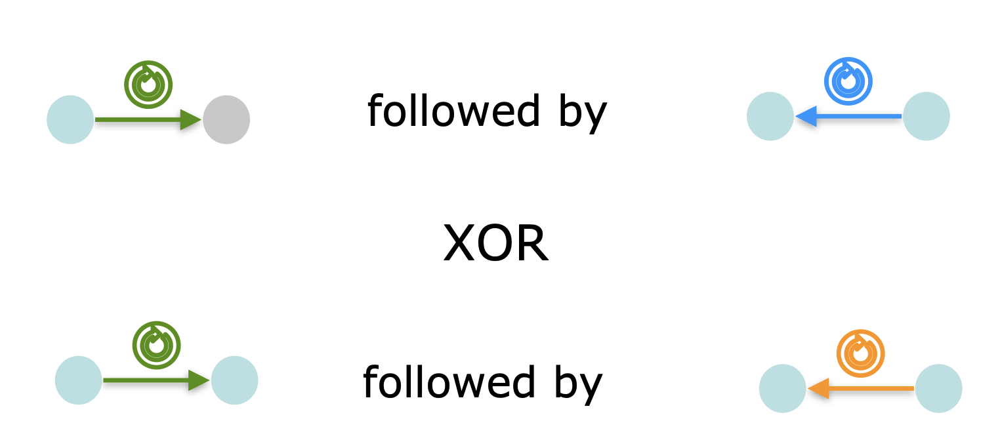

Il numero di messaggi totali, e quindi la Message Complexity è di $2m$: 2 messaggi per link. 

> Questo non è migliorabile perchè almeno un messaggio per arco deve passare quindi la complessità è comunque nell'ordine di $\Omega(m)$

Il tempo lo possiamo calcolare calcolando la catena dei messsaggi, essendo in ordine sequenziale, troviamo che la **Time Complexity** è di $2m$.

Possiamo migliorare perchè tecnicamente il lower bound è 
$$
Time(DFT(G)) \ge n− 1
$$

Nell'ottica di fare la visita in sequenziale so che il back-edge mi spreca molto tempo, risulta inutile. Per migliorare questa situazione basta sapere quali sono i nodi già visitati. Questo si può fare nel seguente modo:
-  nel momento in cui divento visitato avviso i miei vicini che sono entrato nei visitati (questo lo posso fare in parallelo)
   -  i vicini in questo modo non proveranno mai a visitarmi

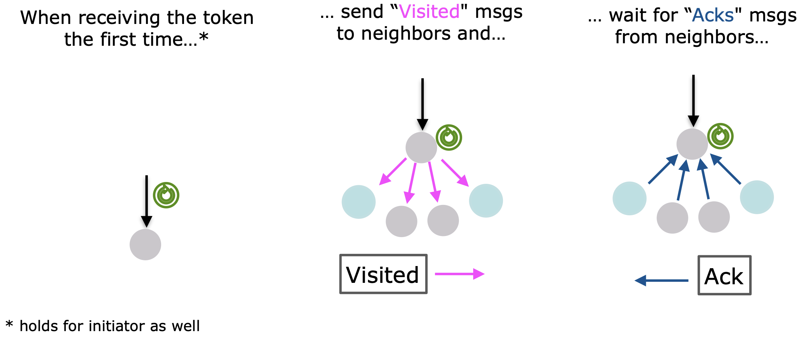

Per evitare che il Forward Token arrivi prima (tramite un altro path) del messaggio che annuncia ai vicini che il nodo è visitato (VISITED), aspetto L'ACK, una volta che sono arrivati da tutti i vicini vado avanti come nel protocollo normale.

In generale se il nodo è un nodo visitato o no, nel momento in cui un nodo riceve un VISITED, rispondono con un ACK.

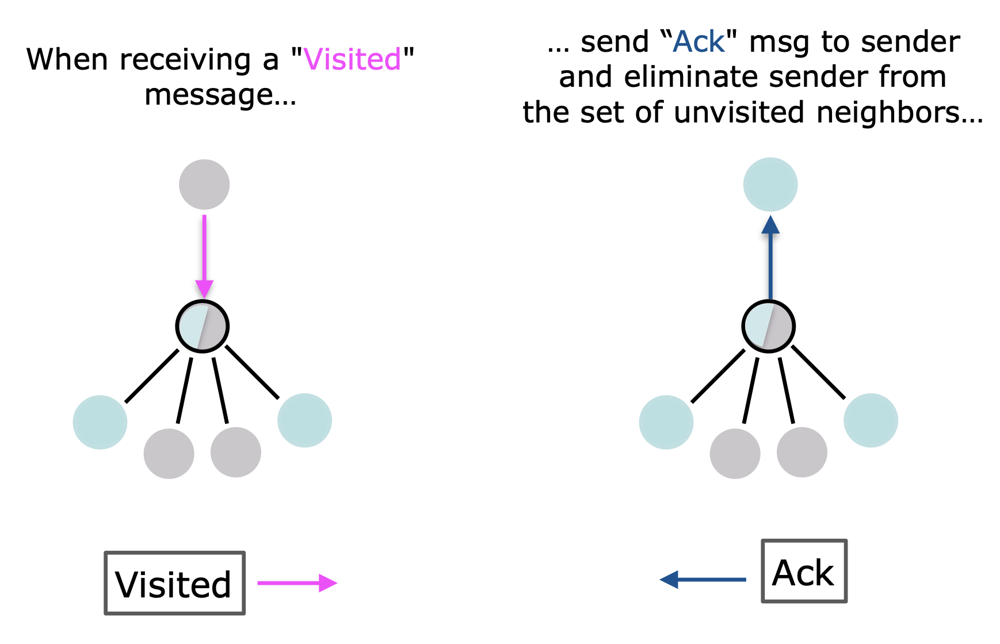

Con questo tipo di modifica ora i messaggi che passano su un nodo sono di 4 tipi:
- 2 Token (Visited e Return)
- Visited e ACK

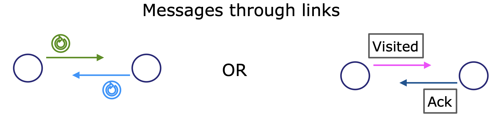

i messaggi dei token passano in sequenziale e viaggiano solo su gli archi che saranno dello spanning tree: quindi si forma una catena lunga al massimo $2(n-1)$; intervallati ci sono i messaggi VISITED-ACK, la catena più lunga di questi messaggi che si può creare è di $2$ (nodo-vicino-indietro) per ogni nodo (e non è in contemporanea alla visita)

Allora la catena più lunga di messaggi diventa:
$$
2(n-1) + 2n = 4n - 2
$$
perchè i messaggi ACK si somma non essendo in contemporanea ai messaggi dei Token.

Facendo così però cambia il numero di messaggi aumenta:
- $2(n-1)$ ovvero 1 Messaggio Forward e 1 messaggio Return per ogni arco dello spanning tree.
- i messaggi VISITED-ACK passano sugli archi dello spanning tree $2(n-1)$, sugli archi che non sono dello spanning tree passano 4 messaggi (2 visited 2 ACK)

$$
2(n-1) + 2(n-1) + 4(m -(n-1)) = 4m
$$

### Confronto SHOUT e Traversal

È difficile abbassare il costo dei messaggi contemporaneamente al tempo. dipende dall'applicazione quale protocollo usare.

in generale 
$$
Message(SHOUT+) = 2m\\
Message(DFT) = 2m  \space(\text{o } 4m)
$$

Queste due tecniche costruiscono alberi diversi, dello SHOUT+ non sappiamo bene che albero venga fuori, mentre con DFT lo costruiamo appositamente in una maniera specifica, ma in generale DFT costruisce alberi con diametri terribili.

> In generale si optano per alberi con il diametro più piccolo possibile


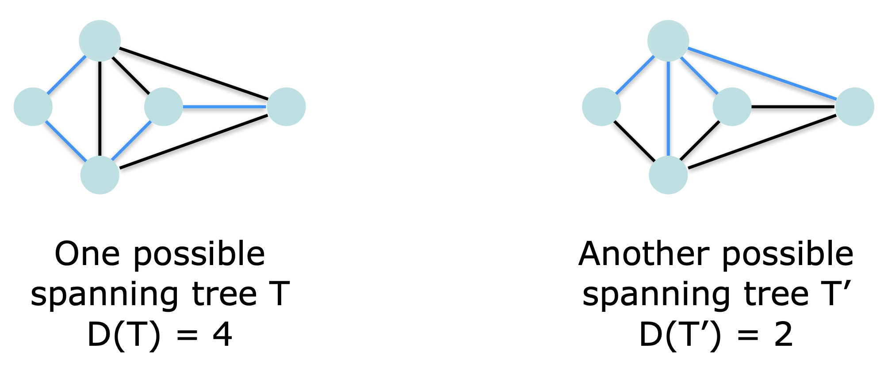

Si potrevve fare con un Broadcast-Tree Construction:
1. Determinare il centro di G
2. Costruire un breadth-first spanning tree con radice nel centro

Sia il task 1. e 2. sono molto costosi.

---

Entrambi questi algoritmi non funzionano con multipli iniziatori


## Spanning tree con iniziatori multipli

O cambiamo la soluzione oppure troviamo un modo per determinare un iniziatore unico (**Leader Election**). Ma entrambe le cose sono impossibili da attuare se vogliamo utilizzare un protocollo deterministico, a meno che non ci siano idetificativi univoci ad ogni entità con la sicurezza che siano tutti quanti diversi.

aggiungiamo una restrizione quindi al problema:
- ID Univoco per ogni entità
  
#### Prima Idea

ogni iniziatore costruisce il suo spanning tree con un algoritmo a singolo iniziatore e utilizza l'id dell'iniziatore per identificare le varie costruzioni.

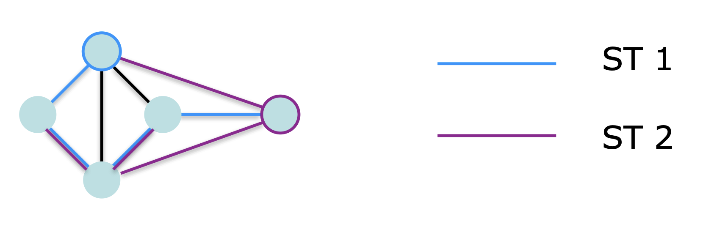

I costi in questo si moltiplicano per il numero di iniziatori, in generale è molto costoso.

#### Seconda Idea

Ogni iniziatore avvia la costruzione del proprio spanning tree utilizzando un protocollo a iniziatore singolo, impiegando il proprio ID per identificare l’albero che sta costruendo.
Se per esempio voglio costruire l'albero che ha la sorgente con l'ID più piccolo le entità alla fine smetteranno di partecipare a tutte le altre costruzioni, mantenendo soltanto lo spanning tree dell’iniziatore con l’ID più piccolo, stoppando le altre.


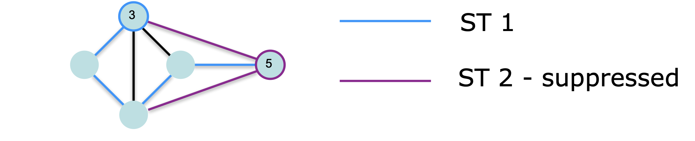

Anche qui i costi non sono migliori (nel caso peggiore), poichè se lo stop degli alberi che poi verranno scartati avviene verso la fine della costruzione, vado a pagare più o meno lo stesso costo della prima idea.

## Computation in unrooted trees

**Restrizioni:**
- Bidirectional links
- Connectivity
- FIFO messages
- Full reliability
- Conoscenza della topologia: ogni entità sa di essere in un albero, e conosce se è una foglia o un nodo interno.
  
### Saturation Trchinique

Ogni entatià $x$ ha un valore di input $v(x)$. Alla fine ogni entità devono sapere se il loro valore è il più piccolo o no


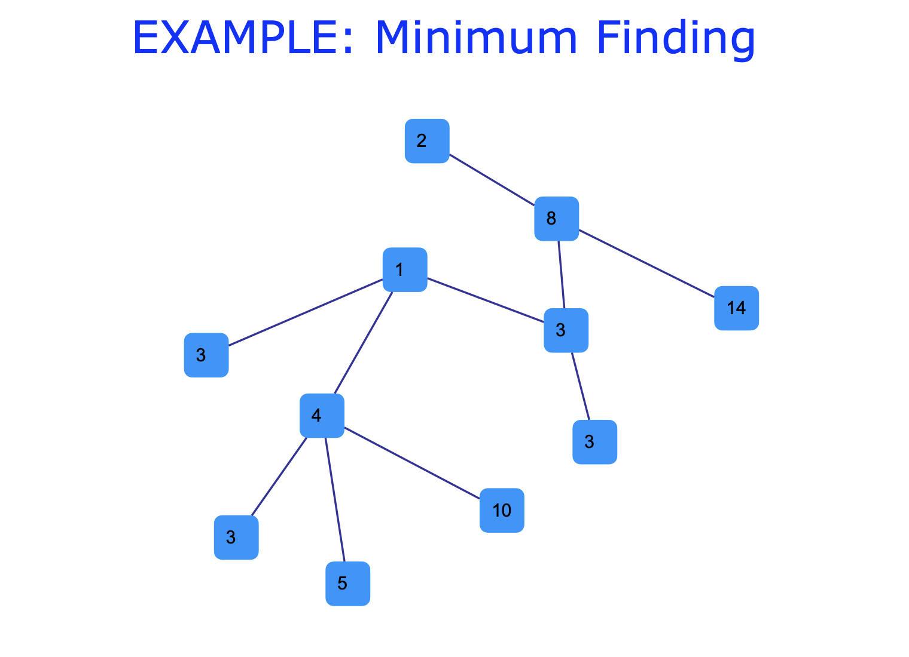

- All'inizio della computazione le foglie iniziano a mandare (all'unico vicino = padre) il loro valore.
- Un nodo interno deve aspettare da tutti quanti i miei vicini tranne uno, e lo manda all'ultimo vicino che gli manca.
  - prima di inviare il messaggio all'ultimo vicino calcola il minimo
- Ad un certo punto ci saranno due nodi che receveranno un messaggio da tutti i vicini (= **nodi saturati**), a questo punto si sa che la computazione è terminata.
- A questo punto i nodi che terminano sanno di avere il minimo di tutto l'albero e rimandano indietro il valore calcolato.

Questo si può generalizzare:
1. Fase di Attivazione: fase di wake up (almeno le foglie), dove le entità vengono svegliate
   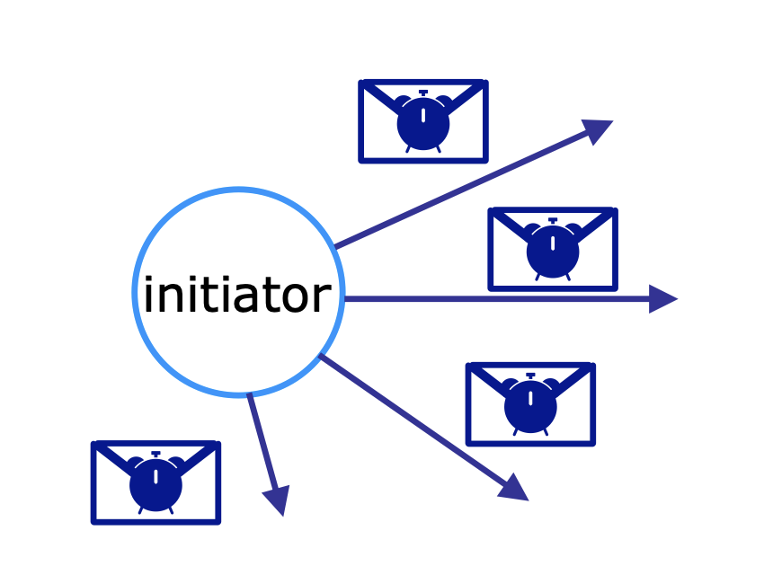

2. Fase di Saturazione: le foglie iniziano a mandare il loro valore al padre, alla fine una coppia entità viene scelta
   
   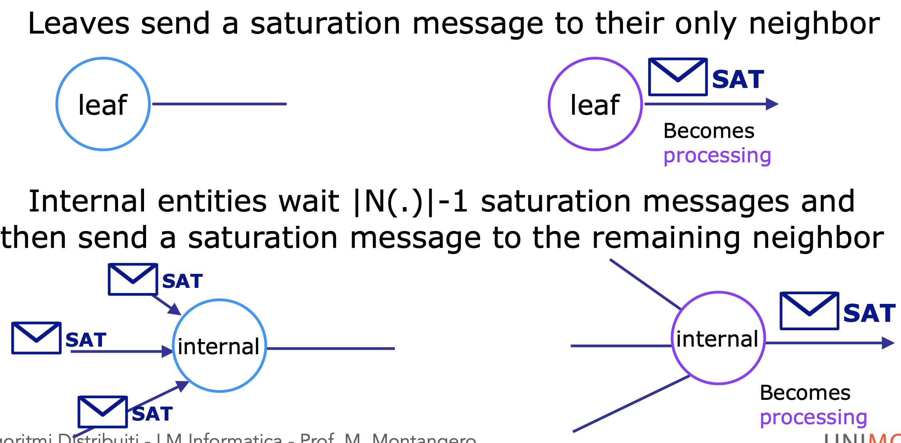
3. Fase di Risoluzione: partendo dalla coppia scelta (nodi saturati) parte l'invio del minimo a tutti.
   
   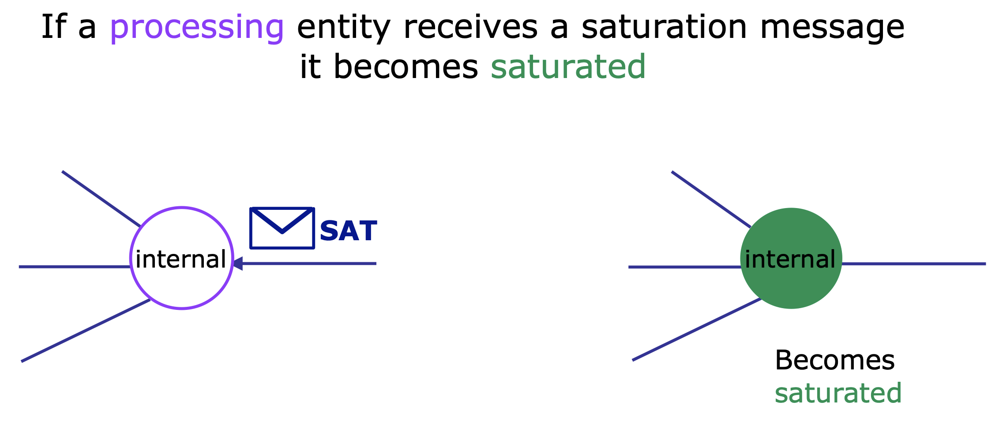

> È dimostrabile che esattamente 2 entità diventeranno saturate, queste entità saranno vicini

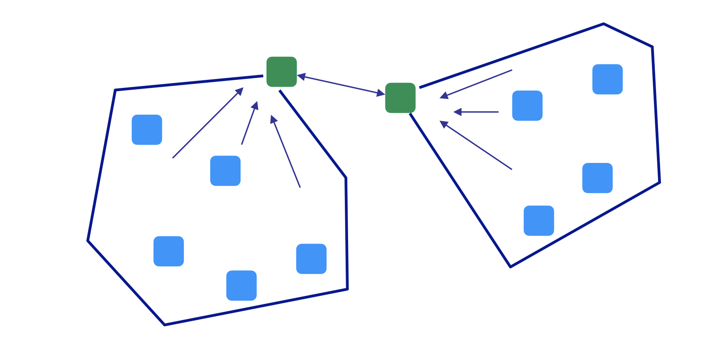

Esecuzione differenti porteranno diverse coppie saturate, ma sempre 2 e vicine.

#### Costo dei messaggi
- Attivazione: durante questa fase alcuni si svegliano e fanno un wake-up
  - Nel caso peggiore (tutti svegli fino dall'inizio) passano $2(n-1)$ messaggi (due per ogni arco)
  - Costo $\leq 2(n-1) \text{ messaggi}$
- Saturazione: durante questa fase passa 1 messaggio per ogni link, l'unico link su cui viaggiano 2 messaggi è quello tra i due saturati
  - Costo = $(n-1) + 1 = n \text{ messaggi}$  
- Risoluzione: durante questa fase viene inviato un messaggio per ogni link, meno quello tra i due saturati
  - Costo = $(n-1) -1 = n-2 \text{ messaggi}$
  
Questo porta un totale di $4n - 4 \text{ messaggi}$

> Questo è comunque calcolato in un caso in cui nessun link fallisca, condizione ottima, comunque se l'albero è costruito sopra ad una struttura più complessa, nel caso di caduta di un link dell'albero si può fare rollback alla struttura originale.

## Computation in rooted trees

Quando siamo in un albero radicato, dove tutti conoscono chi sono i figli e chi è il padre, e si ha un senso di up-down. c'è un unico nodo diverso dagli altri, il nodo radice che può diventare il leader, capace di far partire i protocolli (es. "io sono la radice, se si faccio partire il protocollo").

Quello che succede solitamente è che i protocolli sono delle specie di onde che fanno su e giù dall'albero: la radice manda un broadcast fino ad arrivare a tutte le foglie, e le foglie rimandano indietro con un Converdecast (tutti mandano al padre).

> Teorema: È impossibile scegliere la ROOT da un albero senza radice se non ci sono degli ID univoci.


