# Leader Election

Partendo da un sistema in cui c'è una completa simmetria tra le entità (tutti ugulai, nessuno più importante) e vogliamo arrivare ad una situazione in cui uno solo diventa diverso: leader. Gli altri tradizionalmente chiamati Follower (e tutte le entità sanno se sono leader o follower).

> il leader ci serve per esempio per far partire i protocolli a iniziatore singolo.

Non è detto che non si riescano a risolvere problemi con algoritmi con iniziatori multipli, ma spesso è più facile eleggere e poi utilizzare un algoritmo a iniziatore singolo

> Teorema: il problema della Leader Election è inrisolvibile (non ci sono protocolli deterministici) se le entità non hanno ID differenti

## Leader election on Tree

- Se l'albero è Rooted, il lieader diventa automaticamente la radice. ci vogliono 0 messaggi per decidere questo, al massimo una notifica $O(n)$ a tutti per dire che il protocollo è finito.
- Se l'albero non è radicato (ma hanno ID) allora si cerca il Minimo ID utilizzando la Saturation Technique
  - normalmente la tecnica della saturazione ha una complessità dei messaggi di $\leq 4n -4$
  - determiare le due entità saturate utilizzando $c \in O(1)$ bits per messaggio; dove $c$ è il minimo numero di bit per distinguere i messaggi durante la saturazione
    - Se conto i bit che spedisco $\in O(2 \log{MaxID} + cn)$

## Leader Election on Ring

Il ring è una rete estremamente simmetrica:
- ogni nodo ha 2 vicini
- se hanno il senso della direzione sanno qual'è il vicino di destra e quello di sinistra
- se hanno un orientamento locale, distinguono un lato dall'altro senza sapere destvra o sinistra

> è una topologia sparsa con pochi link utilizzata molto nel passato, rispetto ad un albero è più robusto a fallimenti di link o nodi

**Generalmente**
- Una sola entità deve essere eletta
- Le entità devono avere un ID univoco
- il leader è quello con l'ID univico più piccolo


### All the Way (Le Lann)

Siamo in un caso in cui abbiamo:
- Link Bidirezionali/Unidirezionali
- Local Orientation
- ID distinti
  
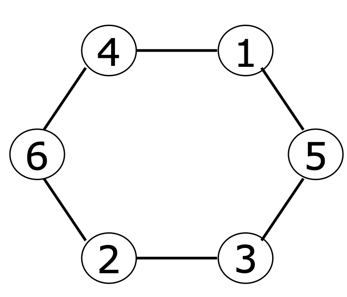

Idea di base:
1. ogni entità manda il suo id in una direzione
2. Ogni entità che riceve un messaggio lo manda avanti e tiene traccia del minimo

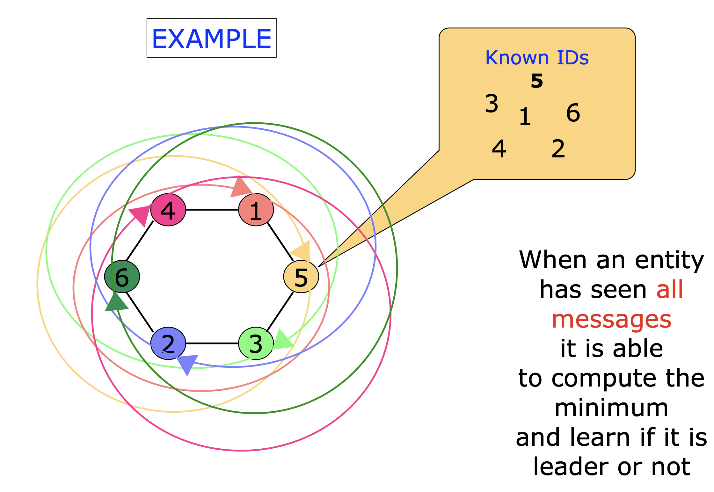

> il problema visto così può non terminare, vanno fatte considerazioni aggiuntive

Per sapere se ho visto tutti i nodi ci sono due possibilità (aumentando le assunzioni):
- I link sono FIFO (prima mandano il loro poi quello che ricevono)
- Tutti sanno $n$ ovvero la grandezza del ring

È possibile però calcolare il numero di nodi che ci sono nel ring, quando un messaggio parte, passa per tutti i nodi, quindi nel messaggio allego un contatore, che viene incrementato da ogni nodo che incontra.

> termina ed è corretto

#### Pseudocodice

```rust
State S = {ASLEEP, AWAKE, FOLLOWER, LEADER}
Sinit = {ASLEEP}
Sterm = {FOLLOWER, LEADER}
```

```rust
ASLEEP
spontaneously
    INITIALIZE
    become (AWAKE)

receiving(“Election”,ID,counter)
    INITIALIZE
    send(“Election”,ID,counter +1) to other;
    MIN := min{MIN,ID}
    count := count + 1
    become(AWAKE)
```

```rust
procedure INITIALIZE
count := 1
ringsize := 1
known := false
send(“Election”,id(x),1) to one neighbour; // id(x) is the ID of entity x
MIN := id(x)
```
A questo punto deve mandare i messaggi avanti fino a che non gli arriva il suo
```rust
AWAKE
receiving(“Election”,ID,counter)
    if ID != id(x)
    then
        send(“Election”,ID,counter +1) to other;
        MIN := min{MIN,ID}
        count := count + 1
        if known = true
        then
            CHECK
    else
        ringsize := counter
        known := true
        CHECK
```

```rust
procedure CHECK
if count = ringsize
then
    if MIN = id(x)
    then
        become(LEADER)
    else
        become(FOLLOWER)
```


#### Costo

**Messaggi**
Su ogni link viene mandato l'ID dell'entità, la dimensione del messaggio quindi deve essere almeno $\log{ID}$ bit. A questo va aggiunto anche il contatore, anche esso sempre di dimensione $\log{n}$ bit.

Il totale dei messaggi è di $n^2$ poichè ogni entità genera 1 messaggio che gira su $n$ link per $n$ entità.

il numero totale di bit quindi diventa $O(n^2 \log(MaxID))$

**Tempo**

Poichè i messaggi con identificativo uguale sono in sequenziale, mentre quelli con ID differenti possono andare in parallelo, il caso peggiore diventa quando parte un singolo iniziatore, poichè deve svegliare gli altri che faranno partire il loro messaggio prima.

La catena di messaggi più grande diventa di $n-1$ messaggi per svegliare gi altri $+$ $n$ messaggi per l'ultimo che si è svegliato (che deve fare tutto il giro per ultimo).
La lunghezza della catena di messaggi più lunga diventa quindi di $2(n-1) = O(n)$


### As Far as it can (LCR)

l'idea è quella di non propagare i messaggi con ID più grande degli ID già visti (compresi anche il loro stesso).

> Mando avanti solo il più piccolo


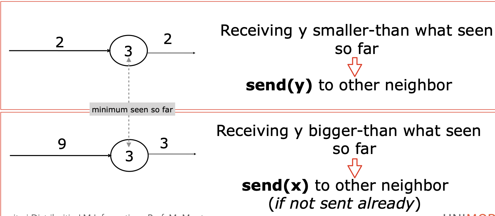

Le restrizioni sono le stesse:
- Unidirectional/Bidirectional links
- Local Orientation
- ID distinti

> in questo caso non ci serve sapere la dimensione dell'anello e il numero di nodi

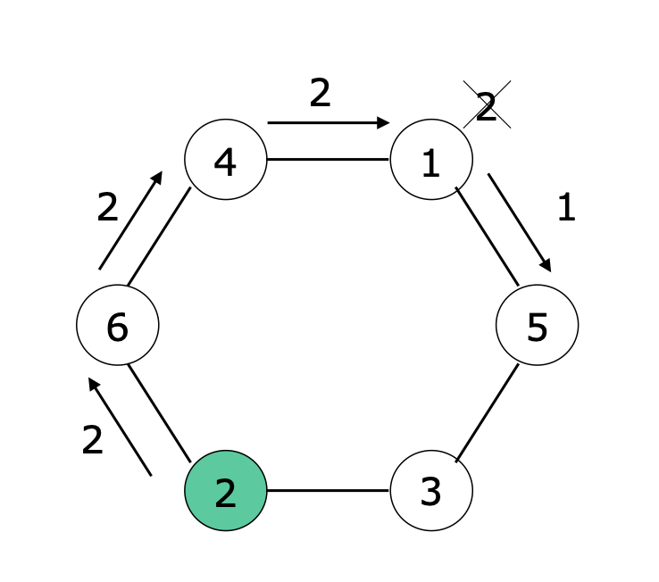

In questo caso le entità non sanno quando terminare, quando il leader si eleggerà (perchè gli ritorna il suo id che è il minimo), dovrà inviare un messaggio di terminazione dicendo che il leader è stato eletto.

> I nodi non possono terminare di loro spontanea volontà poichè dopo non potranno passare

#### Pseudocodice

```rust
State S = {ASLEEP, AWAKE, FOLLOWER, LEADER}
Sinit = {ASLEEP}
Sterm = {FOLLOWER, LEADER}
```
```rust
ASLEEP
spontaneously
    send(“Election”,id(x)) to one neighbour // entity’s value
    min := id(x)
    become(AWAKE)
receiving(“Election”,ID)
    min := id(x)
    if ID < min
    then
        send(“Election”, ID) to other // the received value
        min := ID
    else
        send(“Election”,id(x)) to other // entity’s value
    become(AWAKE)
```
Se sono svegli possono girare due messaggi, il messaggio di elezione e la notifica del leader.

```rust
AWAKE
receiving(“Election”,ID)
    if ID < min
    then
        send(“Election”, ID) to other // the received value
        min := ID
    else
        if ID = min
        then
            send(“Notify”) to other
            become(LEADER)

receiving(“Notify”)
    send(“Notify”) to other
    become(FOLLOWER)
```

Termina se viene mandata la notifica, se non viene mandata la notifica non può terminare. È corretto perchè l'unico messaggio che fa il giro completo del ring è quello del leader.

Se i link sono bidirezionali non cambia, tutti i messaggi che non sono leader verranno stoppati dal futuro leader.

Non è neanche necessaria la conoscenza dei nodi

#### Costo

**Messaggi**

Il caso peggiore, con link unidirezionali, con una specifica disposizione dei nodi (crescente) e si svegliano contemporaneamente.

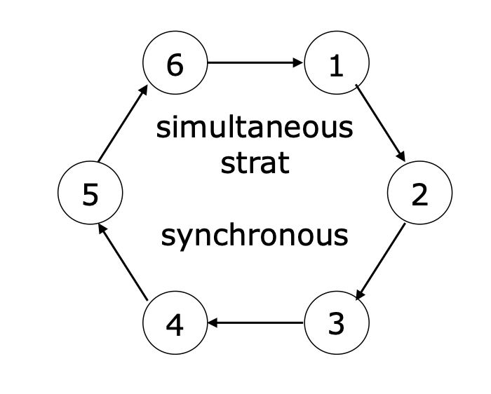

- Al primo giro viene stoppato il 6
- Al secondo giro viene stoppato il 5
- ....

Almeno un messaggio a iterazione viene stoppato, peggio di così non può andare. 
- Il messaggio del leader passa tutti i link $=n$
- Il messaggio del 2nd ID più piccolo fa passa per $n-1$ link
- così via per tutti 

> diventa la somma dei primi $n$ numeri naturali che è nell'ordine di $n^2$

$$
n + (n-1) + (n-2) + ... + 1 = \\
\sum_{i=1}^{n}i = \frac{n(n+1)}{2}
$$

più $n$ link per la notifica

Nel caso migliore, ovvero il singolo iniziatore che è anche l'entità che ha ID più piccolo, ovvero il futuro leader:
- passa 1 messaggio per election su $n$ link
- In più 1 messaggio per notifica su $n$ link

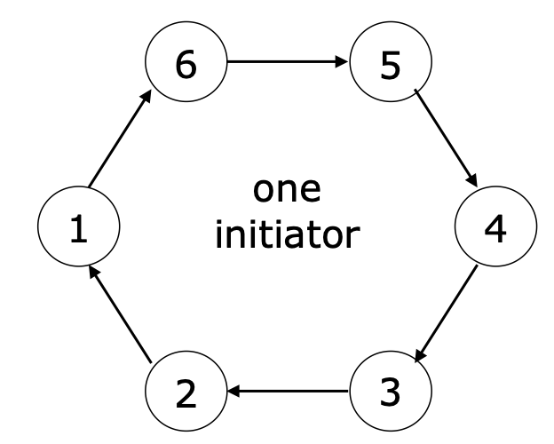


Il totale dei messaggi quindi diventa $2n$

**Tempo**

La catena più lunga di messaggi in sequenza è:
- $n$ per il messaggio del leader (si fa tutto il giro)
- $n$ per la notifica che il leader è stato eletto

La situazione peggiore è quando il leader parte il più tardi possibile, ovvero quando l'iniziatore è un vicino del leader, ma i messaggi girano nel varso opposto:
- questo aggiunge $n-1$ messaggi alla catena totale

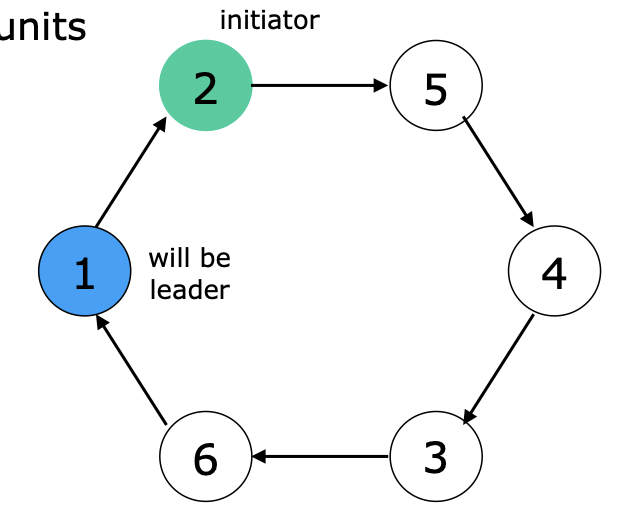

Questo porta il numero totali di messaggi a 
$$
n + (n-1) + n = O(n)
$$

> Questo oltretutto è il caso migliore per l'invio dei messaggi

Riusciamo a scendere sotto l'$n^2$?

### Controlled Distance (HS)

Le restrizioni in questo caso cambiano:
- Bidirectional links
- Local Orientation
- Total Reliability
- ID distinti

Questo protocollo lavora per passi successivi, ogni entità tiene traccia del passo in cui si trova. Ad ogni passo il nodo è in due stati:
- o candidato leader
- o è defeated, non partecipa alla lizza per la leadership.

Al passo successivo i candidati cercano di diventare leader sconfiggendone un altro. fina a che dopo un numero finito di passi ne rimane solo 1.

Questo protocollo quindi lavora per passi.

**Stage i:**
1. ogni candidato manda un messaggio con il suo ID in entrambe le direzioni
2. il messaggio viaggia fino a che non incontra un ID più piccolo o se raggiunge una distanza $d_i = 2^i$ (es. viaggia per $d_i$ link)
    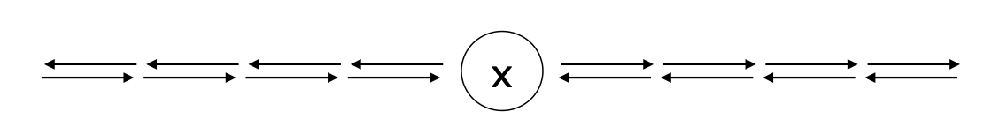
3. Se il messaggio non incontra un ID più piccolo, ritorna indientro all'origine
4. Un candidato che riceve il suo ID da entrambe le direzioni sopravvive allo stage e ricomincia il prossimo stage come candidato.

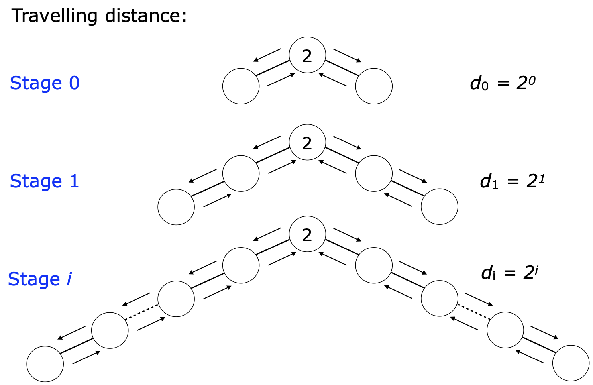

Sempre per lo stage i se il messaggio con l'ID incontra una entità $x$ durante il viaggio, essa legge il messaggio e:
1. se l'id del messaggio è più piccolo dell'id(x), allora $x$ diventa defeated 
2. i defeated semplicemente mandano avanti i messaggi e terminano quando viene mandato un segnale di terminazione

<div style="display: flex; justify-content: space-around;">
    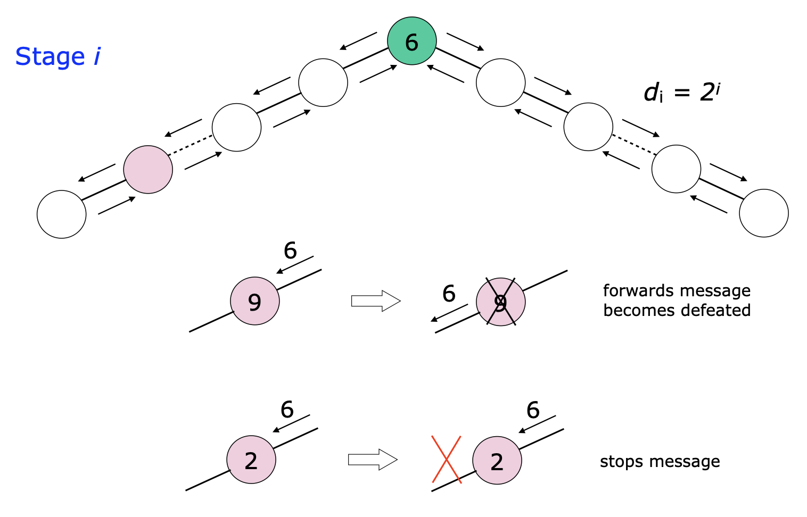
    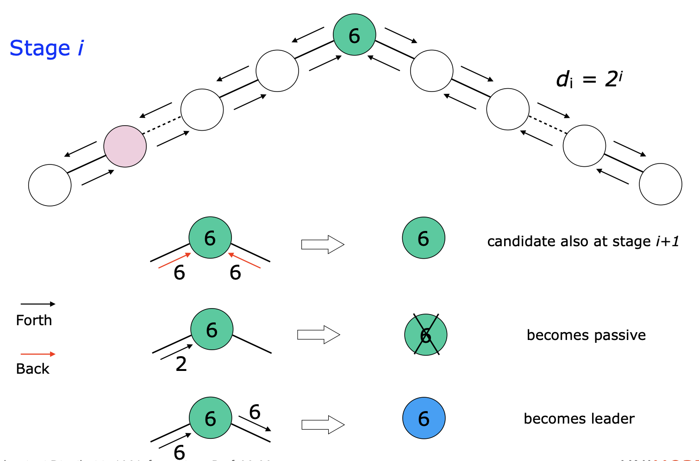
</div>

Aumentando così la distanza si arriva ad un punto nel quale la distanza supera la dimensione del ring. l'entità che si vede arrivare il suo ID dalla direzione opposta nella quale era stata inviata allora sa che è il leader.

A questo punto tutti gli altri saranno in stato defeated e quindi il leader dovrà inviare un messaggio a tutti di terminazione.

> il leader si può fermare anche solo quando 1 dei due messaggi con il suo ID torna dall'altra direzione

#### Pseudocodice

```rust
State S = {ASLEEP, CANDIDATE, DEFEATED,FOLLOWER, LEADER}
Sinit = {ASLEEP}
Sterm = {FOLLOWER, LEADER}
```
```rust
ASLEEP
spontaneously
    INITIALIZE
    become(CANDIDATE)
receiving(“Forth”,ID,limit*)
    // entity’s value
    if ID < id(x) 
    then
        PROCESS-MESSAGE
        become(DEFEATED)
    else
    INITIALIZE
    become(CANDIDATE)
```

```rust
procedure PROCESS-MESSAGE
    limit* := limit* - 1
    if limit* = 0
    then
        send(“Back”,ID) to sender
    else
        send(“Forth”,ID,limit*)to other
```

```rust
procedure INITIALIZE
    limit := 1
    count := 0
    send(“Forth”,id(x),limit) to both neighbours
```

```rust
CANDIDATE
receiving(“Forth”,ID,limit*)
    if ID < id(x)
    then
        PROCESS-MESSAGE
        become(DEFEATED)
    else
        if ID = id(x)
        then
            then send(“Notify”) to other
            become(LEADER)
receiving(“Back”,ID)
    if ID = id(x)
    then
        CHECK
```

```rust
procedure CHECK
    count = count + 1
    if count = 2
    then // inizia nuovo stage
        count = 0
        limit = 2 * limit
        send(“Forth”,ID,limit) to neighbours
```

```rust
DEFEATED
receiving(“Forth”,ID,limit*)
    PROCESS-MESSAGE
receiving(“Back”,ID)
    send(“Back”,ID) to other
receiving(“Notify”)
    send(“Notify”) to other
    become(FOLLOWER)
```

L'algoritmo è corretto e termina

#### Costo

**Messaggi**: Sembra che i messaggi siano tanti, perchè c'è un continuo via vai di messaggi avanti indietro che rimbalzano.

Cerchiamo quindi un upper bound nel caso peggiore:

in un generico passo `i` nel caso peggiore:
- un generico candidato genera $2 \times 2^i$ messaggi
- Per fare avanti e indietro $2 \times (2 \times 2^i)$ messaggi

Quale può essere il massimo numero di candidati al generico passo `i`? Se sono un candidato al passo `i`-esimo, al passo precedente ho eliminato tutti gli altri candidati: ovvero fra due nodi candidati ci sono $2^{i-1}$ entità che sono state sconfitte, il prossimo candidati leader si trova a $2^{i-1} + 1$ nodi del ring.
Quindi in totale possono esserci 

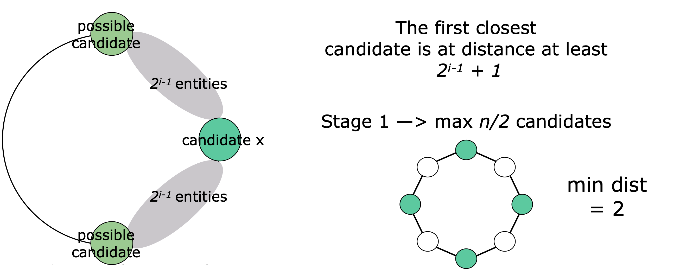

Il numero massimo di candidati al passo `i` è:
$$
\lfloor\frac{n}{2^{i-1}+1}\rfloor
$$

allora:
- il numero di messaggi per candidato è $4 \times 2^i$
- il numero massimo di candidati è $\lfloor\frac{n}{2^{i-1}+1}\rfloor$

allora il numero di messaggio allo stage `i` è $O(n)$
$$
(4 \times 2^i) \times \lfloor\frac{n}{2^{i-1}+1}\rfloor \leq  8 \times 2^{i-1} \times \frac{n}{2^{i-1}+1} = 8n \times \frac{2^{i-1}}{2^{i-1}+1} \leq 8n
$$

Quanti stage ci sono?
il numero totale di stage è `s`. Il leader per essere tale deve avere almeno un messaggio che fa il giro completo del ring. il `limit` è il più piccolo intero tale che `limit` $\ge n$ e cerchiamo:
$$
\text{limit} = 2^d \ge n \rightarrow d = \lfloor \log n \rfloor\\
s = d +1 = \lfloor \log n \rfloor +1 
$$

Calcoliamo ora i messaggi che vengono spediti:
- il numero massimo di messaggi allo stage 0 è di $4n$
- il numero massimo di messaggi nello stage 1 $\leq i \leq \lceil \log n \rceil -1 : 8n$
- il massimo numero di messaggi nello stage $\lceil \log n \rceil : 2n$
- il numero di messaggi per la notifica è $n$

il numero totale di messaggi è quindi:
$$
4n + \sum_{i=1}^{\lceil \log n \rceil -1}8n + 2n +n = 7n +8n(\lceil \log n \rceil -1) \in O(n \log n )
$$

> Per quanto riguarda la time complexity è abbastanza complicata da calcolare, quindi non la dimostriamo

---
Questi algoritmi visti fino ad ora si utilizzano sui ring, sia fisici che virtuali, ovvero, magari la rete si configura con un ring per poi utilizzare altri protocolli sviluppati per il ring.


## Universal Election Protocol

È un protocollo che funziona su qualsiasi network e non richiede la conoscenza della topologia della rete.

**Idea**

Inondare (Flood) il massimo ID (si può fare anche con il minimo) attraverso il network. È simile a **All the way**.

**Restrizioni**
- Bidirectional Link
- ID distinti
- Connected Graph
- No Failures
- Canali FIFO
- Le entità conoscono il diametro del grafo $d$, o almeno un upperbound (es. il numero di nodi)

l'idea è che ognuno faccia girare il suo identificativo nella rete: ogni entità tiene il massimo che vede.
Faccio lavorare l'algoritmo in round:
- in ogni round $r$ ogni entità $x$ manda il Max ai vicini $N(x)$ e aspetta gli ID dei suoi vicini, e poi calcola il massimo
- dopo $d$ round, se il Max è l'ID dell'entità $x$ allora elegge se stesso come leader, altrimenti diventa follower

### Pseudocodice

```rust
State S = {ASLEEP,AWAKE, FOLLOWER, LEADER}
Sinit = {ASLEEP}
Sterm = {FOLLOWER, LEADER}
```

```rust
ASLEEP
spontaneously
    INITIALIZE
    send(max_id,round) to N(x)
    become(AWAKE)
receiving(ID,R)
    INITIALIZE
    if ID > id(x)
    then
        max_id := ID
    count := count + 1
    send(max_id,round) to N(x)
    become(AWAKE)
```

```rust
procedure INITIALIZE
    round := 1
    count := 0
    max_id = id(x)
```
Quando sono AWAKE mi può arrivare un unico tipo di messaggio. Bisogna stare attenti al tempo dei messaggi, devo dividere bene i messaggi per round
```rust
AWAKE
receiving(ID,R)
    if R > round
    then
        leave msg in queue
    else
        PROCESS-MESSAGE
        if count = |N(x)|
        then
            if round = d
            then
                if max_id = id(x)
                    become(LEADER)
                else
                    become(FOLLOWER)
        else
            round := round + 1
            count := 0
            send(max_id,round) to N(x)
            PROCESS-MESSAGE-IN-QUEUES
```
`PROCESS-MESSAGE-IN-QUEUES`: for each message in queue with R = round and check eventual round end.
```rust
procedure PROCESS-MESSAGE
    count := count + 1
    if ID > max_id
    then
        max_id := ID
```

**Correttezza**

Dopo $r$ round il massimo ID ha ricevuto tutte le entità nella distanza $r$ del candidato leader.

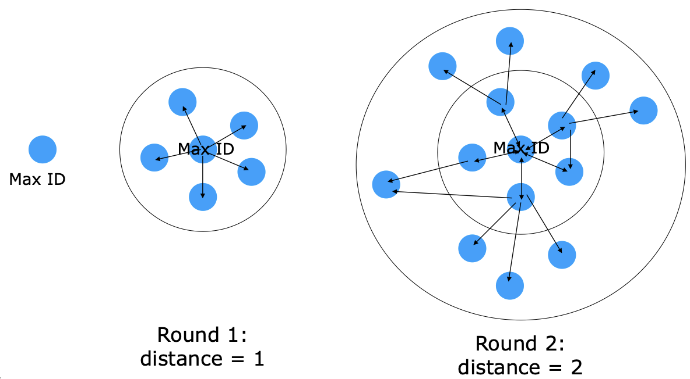


Per ogni nodo raggiungere tutti quanti vuol dire raggiungere il più lontano da lui, che è al massimo alla distanza del diametro ovvero $d$.

### Costo

**Messaggi**
- in ogni round ogni nodo manda un messaggio al vicino, quindi su ogni link passano 2 messaggi

Allora il costo è per ogni round passano 2 messaggi per link
$$
2m * d
$$

**Tempo**

L'identificativo del leader raggiungge l'entità più lontana, quindi nel caso peggiore il nodo più lontano dal grafo è a distanza $d$.

La catena più lunga parte dal entità con ID più grande e si ferma a distanza $d$.

> Ci possono essere molte catene, che magari si biforcano ecc.

Questo funziona per tutti i quanti i grafi, migliore è la stima di $d$ meglio è. C