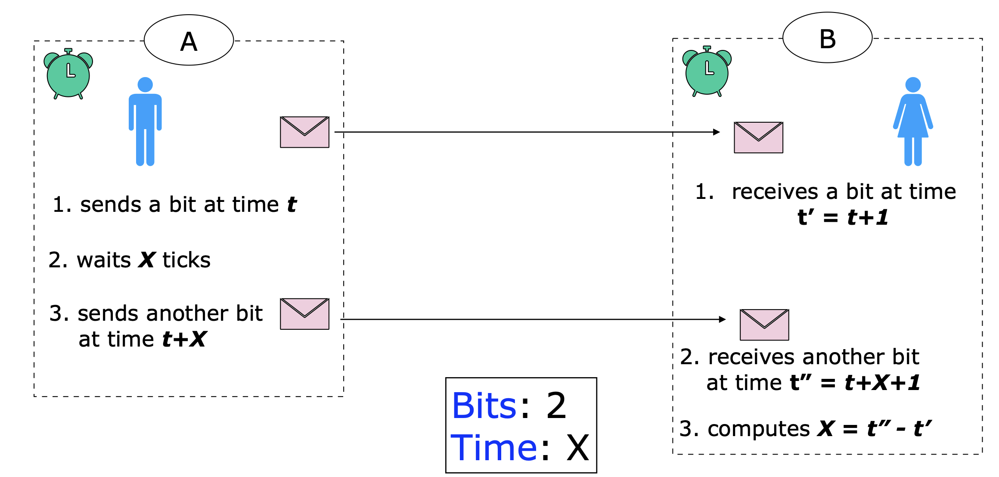
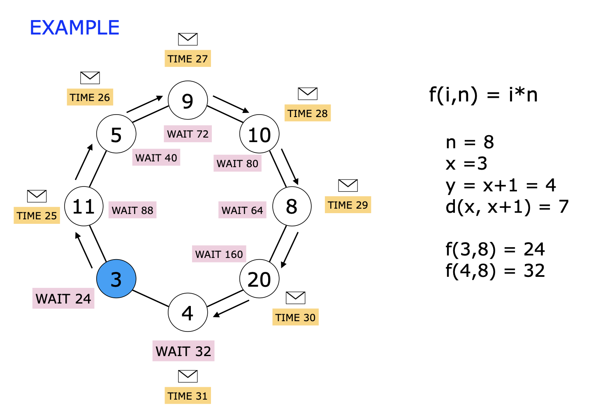
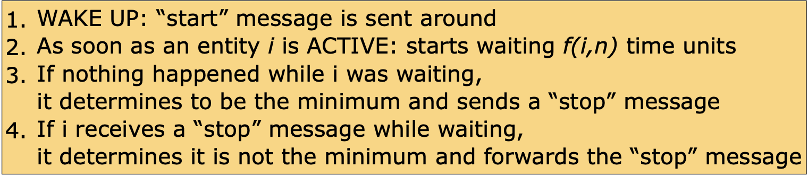

# Fully Synchronous Systems

Nei sistemi sincroni ci sono assunzioni forti per quanto riguarda la sincronizzazione dei clock locale e sui ritardi della comunicazione. 

> Assumiamo sempre che le entità trasmettano il messaggio nel momento in cui "batte" il clock e che venga mandato al vicino un messaggio solo per ogni vicino (anche a più vicini contemporaneamente)

**Restrizioni**:
- Clock sincronizzati
- Bounded Communication delay: conosciamo un upperbound sui ritardi dei messaggi in assenza di fallimenti. abbiamo un $\Delta$ che è il numero massimo di tick che passano al massimo per ricevere un messaggio. Quindi ho una **unità di tempo $u$**

Sicuramente quando siamo in un caso sincorno i messaggi devono avere una lunghezza prefissata, finita e bounded. Se non lo mettessimo potenzialmente stiamo dicendo che in una solo unità di tempo saremmo in grado di spedire un messaggio infinitamente lungo. Bisogna fissare un numero massimo $c$ di bit spedibili nell'unità di tempo. 

> Se il messaggio è più grande va pacchettizzato (in pacchetti di dimensione $c$), gestito quindi nell'algoritmo specifico

#TODO INSERIRE IMMAGINE FULLY SYNC

## Election in syncronous ring: "speeding"

**Idea**: Come in AS-FAR, gli ID più grandi vengono  stoppati da quelli più piccoli. Possiamo cercare di far andare messaggi più velocemente, aggiundendo dei ritardi nell'invio di alcuni messaggi (abbiamo il concetto di velocità per tutti, se un messaggio sta fermo per 3 unità di tempo, lo sarà per tutti).

Per poterli far andare a velocità diverse, dovremo far aspettare i messaggi con ID più grandi.

**Restrizioni**:
- Sincrono
- Link unidirezionali
- Inizio simultaneo (non necessario)

> La conoscenza di $n$ non è necessaria

I ritardi non sono introdotti a livello dei link, ma saranno le entità che aggiungeranno del ritardo.

Quando una entità riceve un messaggio contenente $i$ aspetta un $f(i)$ clock units. Se $i \lt x$ allora aspetto $f(i)$ clock units.
Quando una entità riceve il suo ID, si elegge a **leader** e manda una notifica lungo il ring. Questo messaggio non viene ritardato

> Una $f(i)$ che funziona solitamente è aspettare $2^i$ clock time units.

L'id del leader deve "sorpassare" tutti gli altri, quanto ci mette quindi l'ID più piccolo a fare il giro dell'intero del ring? ci impiega $2^{\text{min}}$ time unit per ogni entità, incontrando $n$ entità (compresa se stessa) e ci impiega una unità di tempo per attraversare il link.
$$
2^{\text{min}}*n + n
$$
Se prendiamo il secondo ID più piccolo impiega:
- Aspetta in ogni entità per $2^{\text{min}+1}$ time units
- contando che il min è $\leq 0$ allora
$$
\frac{(2^{\text{min}} * n + n)}{2^{\text{min}+1}} \leq \frac{n}{2} + \frac{n}{2} = n \text{ entità}
$$ 

Per ogni entità più grande si raddoppia il tempo che aspetta, quindi raddoppia il tempo che impiega a fare il giro.

Questo ritorna nel conto del numero dei messaggi che passano:
$$
n + n + \frac{n}{2} + \frac{n}{4} + \frac{n}{8} + \frac{n}{2^{n-2}} = \\
n + n \sum_{i=0}^{n-2} \frac{1}{2^i} \leq n +2n = 3n \in O(n)
$$

> per quanto riguarda il numero di bit saranno $O(n \log(Max))$

Per quanto riguarda il tempo è $O(2^{\text{min}})$

> Questi calcoli sono ottimistici, più piccoli sono gli identificativi e contigui più si avvicinano a questo caso

In questo contesto dove abbiamo il tempo che è uguale per tutti, diventa importante il silenzio, il non ricevere nessun messaggio può dirci qualcosa, per mandare una informazione senza il costo di inviare un messaggio.

**Esempio**

Una qualsiasi informazione può essere inviata usando 2 BIT:

$$
\space
$$

> Basta avere abbastanza tempo in questo caso

## Election in synchronous rings: "waiting"

**Idea**: ogni entità aspetta che qualcosa accada prima di fare qualcos'altro. Se Non gli arriva nulla si autoelegge leader

**Restrizioni**:
- Sincrono
- Conoscenza di $n$
- ID sono interi
- Link Unidirezionali (non necessario)
  
> Assumiamo che partano tutti simultaneamente e che $d(x,y)$ sia la distanza orientata sul ring tra il nodo $x$ e il nodo $y$

- Ogni enttità con $ID = i$ deve aspettare $f(i)$
- La notifica di elezione deve raggiungere tutte le entità mentre loro stanno ancora aspettando.

Il caso peggiore:
- Leader id = $x$
- y è il vicino prima di lui, ovvero $d(x,y) =n-1$
- ID di $y = x + 1$

quello che dobbiamo avere dalla nostra funzione dobbiamo avere che:
$$
f(x+1,n) - f(x,n) \gt n-1
$$

> Vuol dire che da quando si sveglia il leader, tutti devono dormire ancora, contando anche il fatto che il messagio di notifica deve fare il giro del ring. quindi il $min +1$ deve aggiungere al tempo che aspetta $n-1$.

una funzione di attesa che soddisfa la proprietà è
$$
f(i,n) = i * n
$$

### Senza partenza simultanea

**Idea Wake Up**: Devono essere prima svegliate tutte le entità prima. Quando spontaneamente una entità si sveglia manda il messaggio di Wake up ai suoi vicini e poi inizia ad aspettare. 

> Funziona come prima, ma quanto dobbiamo aspettare? perchè le entità potrebbero svegliarsi a tempi differenti.

1. il futuro leader $x$ deve finire di aspettare prima di tutti gli altri
2. il messaggio mandato da $x$ deve raggiungere $y$ mentre lui sta ancora aspettando

Allora $f(i)$ deve essere tale che:
$$
t(x) + f(x,n) + d(x,y) \lt t(y) + f(y,n)
$$
dove:
- $t(i)$ tempo di sveglia dell'entità $i$
- $x$ Leader ID
- $y$ qualsiasi altra entità

Nel caso peggiore $t(x) \gt t(y)$:
- $t(x) - t(y) \lt n la differenza di tempo fra due non può essere più grande di $n$
- $d(x,y) \lt n$

Allora:
1. $t(x) - t(y) + d(x,y) \lt 2n$
2. $t(x) - t(y) + f(x,n) + d(x,y) \lt f(x,n) + 2n \\ t(x) + f(x,n) + d(x,y) \lt t(y) + [f(x,n) +2n] \leq t(y) + f(y,n)$ 
3. Dobbiamo trovare una funzione di costo tale che $f(x,n) + 2n \leq f(y,n)$

Se vale questa disequazione abbiamo quindi la correttezza della nostra funzione di attesa. 

Il caso peggiore è lo stesso, quando $y$ che è a distanza $n-1$ ha anche l'id contiguo a quello del leader.

una funzione di attesa che soddisfa la proprietà è
$$
f(i,n) = 2n *i
$$

### Costo

**Messaggi** considerando il caso con partenza **non** simultanea
- 2 messaggi per ogni link
- ogni messaggio può essere rappresentato da due bit (uno wake up - uno notifica)

$$
O(n) \text{ bit}
$$

**Tempo**
$t(min) + f(min,n) + n \lt 2n * min +2n$
otteniamo che
$$
O(n*min) \text {time units}
$$

## Universal Waiting

La strategia di wait può essere usata in un qualsiasi grafo $G$ connesso per determinare il minimo ID.

## Randomized Leader Election on ring

Nel caso non abbia id univoci, la leader election deterministica è impossibile: se ci tiriamo fuori dal caso deterministico e andiamo nel caso **non deterministico** allora è possibile fare qualcosa.

Le entità potranno prendere delle decisioni in maniera randomica: esistono due tipi di strategie nel random abbiamo:
- *Monte Carlo protocols*: protocolli che terminano sempre però il risultato è corretto solo per una certa probabilità. Se mi accorgo che il risultato non è corretto riprovo, con un numero ragionevole di tentativi avrò il risultato corretto
- **Las Vegas protocols**: il risultato è sempre corretto, ma c'è una probabilità che il protocollo non termini mai

### Waiting Las Vegas

**Idea**: Si può provare a tirare a caso gli ID, è possibile che ci siano più ID uguali, ma l'importanza è che ci sia un solo minimo; se uno, due o dieci nodi aspettano uguale, ma non sono il minimo, non ci interessa.

In generale:
1. Il protocollo è composto da rounds
2. in ogni round ogni enttità seleziona un numero randomico tra $0$ e $ b \leq n$ come proprio ID
3. Se il minimo degli ID tirati a caso sono valori unici, allora quell'entità diventa il leader, altrimenti si riparte da capo con un nuovo round.

> Come mi accorgo io sono l'unico con l'identificativo più piccolo?

Siamo nel caso sincrono, se io faccio partire la notifica ad un certo istante di tempo, so che tornerà indietro in $n$ unità di tempo. se mi arriva prima so che c'è un'altra entità che si è svegliata prima o in contemporanea a me.

Le assunzioni sono:
- Conoscenza di $n$
- Sincrono
- ID non unici

#### Costo

Considerando un round singolo

**Messaggi**: costa un numero di messaggi dipendenti da $n$, anche se ci sono più notifiche che girano lo faranno per al massimo $n$. se ci sono più notifiche manderò un segnale di restart, quindi: $2n \in O(n)$

**Tempo**: dovrà aspettare il tempo di wait più il giro per la notifica
$$
O(n* \text{min\_id} + n) \text{ e } \text{min\_id} \leq b \rightarrow O(n*b) 
$$

Più è grosso $b$ maggiore sarà il tempo di attesa, il più piccolo tempo di attesa potrebbe essere $b = 1$, in questo modo ogni entità sceglie tra $0$ e $1$ il tempo diventa $O(n)$.

**Quanti Round si fanno?**

Dipende dal criterio di randomness, ovvero non posso tenere $\frac{1}{2}$ per lo $0$ e $\frac{1}{2}$ per l'$1$ poichè otterrei veramente raramente solo una entità che sceglie $0$, ma visto che lo facciamo noi allora ogni entità seleziona:
- $0$ con probabilità $\frac{1}{n}$
- $1$ con probabilità $\frac{n-1}{n}$

Non possiamo diro se l'algoritmo termina, ma possiamo comunque attenderci un valore: calcoliamo le probabilità per ogni round:

la probabilità che una entità $x$ scegla 0 e tutti gli altri scelgano 1 è $\frac{1}{n} (\frac{n-1}{n})^{n-1}$

Ci sono $n$ possibilità di scelta di $x$ allora diventa $n * \frac{1}{n} (\frac{n-1}{n})^{n-1}$ che per $n \rightarrow^{+ \infty} \frac{1}{e}$

quindi la probablità per ogni round diventa:
- in un round $\frac{1}{e}$
- non in un round $1 - \frac{1}{e}$

la probabilità di successo al round $r$ è circa $\frac{1}{e} (1 - \frac{1}{e})^{r-1}$

> È una distribuzione geometrica

essendo $e = 2.7...$ il numero di round atteso è $3$

Quindi in generale se il valore atteso è $3$, il costo complesivo rimane lo stesso:
- **Messaggi** $\in O(n)$ bits
- **Tempo** $\in O(n)$ unità di tempo

---

> Tempo logico: fare in modo che gli eventi accadano nello stesso ordine nel quale ci si aspetta che avvengano
