# Routing Algorithms

**Problema**: una entità $x$ vuole comunicare delle informazioni all'entità $y$, come riesce $x$ a raggiungere $y$?

- *Broadcast Routing*: l'entità $x$ fa broadcast dell'informazione su tutto il network
  - l'entità $y$ rivece eventualmente l'informazione

In generale non è una soluzione pratica, sia perchè è costosa (nel numero di messaggi) e poco sicura.

Vogliamo fare **ROUTING** ovvere determinare un cammino (path) tra una sorgente $x$ e una destinazione $y$.

**Router**: processore dedicato che automaticamente determina la route del messaggio che lo attraversa

- Una parte del messaggio deve contenere il destinatario (address)
- una conoscenza locale che processa il router (routing table)

**Restrizioni**:
- Bidirectional Link
- Connecrivity
- Total Reliability
- Local Orientation
- ID Univoci

---

- gli id sono univoci, globali (per tutti sono lo stesso ID), i link hanno una label e c'è una local orietation ed è possibile che gli sia associato un costo.

Dobbiamo trovare una funzione $f(.)$ di routing, cioè che per ogni destinazione $y$, $f(y)$ è il link nel quale mandare il messaggio per raggiungere la destinazione $y$ (idealmente sullo shortest path).

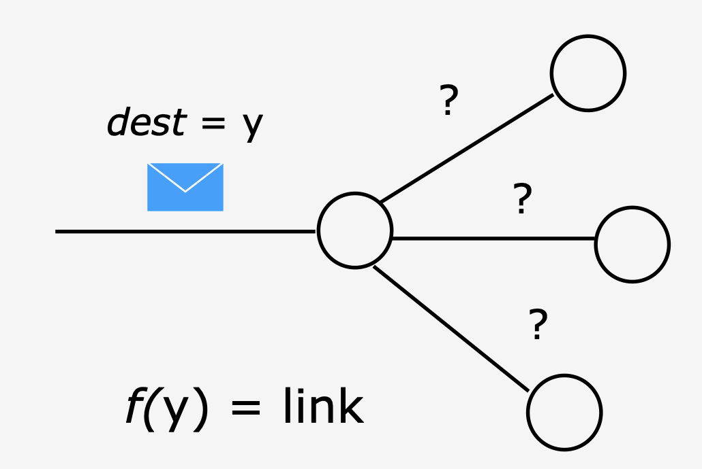

**Routing Table**: quando il messaggio arriva al nodo, consulta una tabella locale che implementa la funzinoe $f(.)$ e determina il link su cui inviare il messaggio.

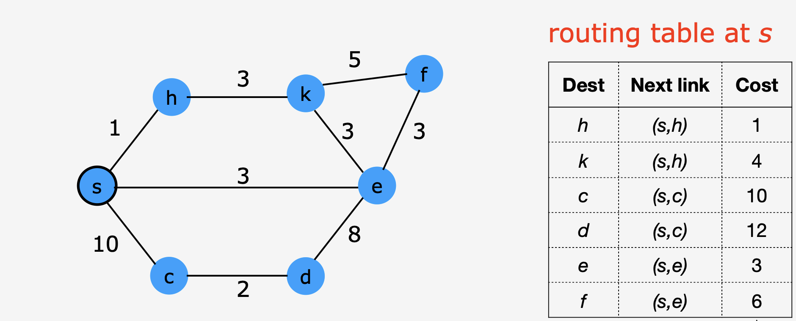

$$
\space{ }
$$

> $n \leq w$ = the largest entity ID

- Per memorizzare un identificativo: $O(n \log w)$
- Per cercare il cammino nella tabella $O(\log n)$ con una binary search

In generale se cerchiamo il cammino minimimo prendiamo sempre il costo minore, poichè il sottocammino del cammino minimo è anche esso un cammino minimo.

> Se un nodo $x$ è sul path $P$ da $a$ a $b$ nello shortest path spanning tree di $a$, allora $P$ è anche una parte dello shortest path spanning tree di $x$

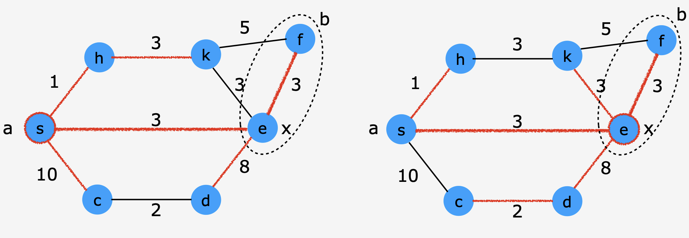

## Routing table: Gossiping

**Problema**: come costruisco la routing table

**Idea**: Per venire a conoscenza di tutto il grafo tutti i nodi si condividono: chi sono i nodi, quali sono i vicini di quel nodo e quanto costano i link. Ognuno dei nodi deve mandare a tutti quanti gli altri questa informazioni.

Questo lo si fa con un Broadcast di tutti a tutti, chiamato **Gossip**. 
Dopo un po tutti i nodi hanno la mappa del grafo, e singolarmente possono calcolarsi il loro albero dei cammini minimi (in locale).

Un modo di fare Gossip è anche:
1. calcolare uno spanning tree
2. ogni entità prende info sui vicini (nomi, edge, costi)
3. ogni entità fa broadcast di qeuste informazioni sull'albero
4. ogni entità computa lo shortest path routing table

### Costo

**Messaggi**: il costo per ogni fase descritta sopra è:
1. con SHOUT+: $O(2m)$
2. Un signo scambio di messaggi tra i vicini $O(2m)$
3. Ogni entità $x$ fa broadcast $deg(x)$ item per ogni informazione attraverso $n-1$ link dello spanning tree
   - per un broadcast: $(n-1) deg(x)$
   - per tutti i broadcast $\sum_{x} ((n-1)deg(x)) = (n-1) \sum_{x} deg(x) = (n-1) * 2m$
4. Nessun costo per la computazione locale

il costo è quindi di $O(nm)$

> Ogni entità deve avere lo spazio per avere l'intera mappa della rete

## Routing Table: iterating

**Idea**:
- inizialmente ogni entità conosce la situazione tra se e i suoi vicini e i vicini conoscono la loro situazione tra loro e i suoi vicini.
- possiamo fare in modo che i vicini si scambino le informazioni in base a quello che conoscono i miei vicini.
- iterativamente espando la conoscenza del grafo

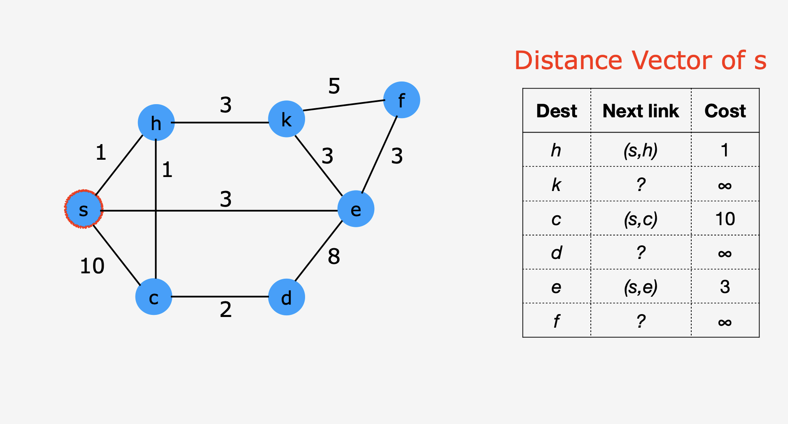

Cosa succede quando vicni si scambiano la loro *distance vector* 

 
    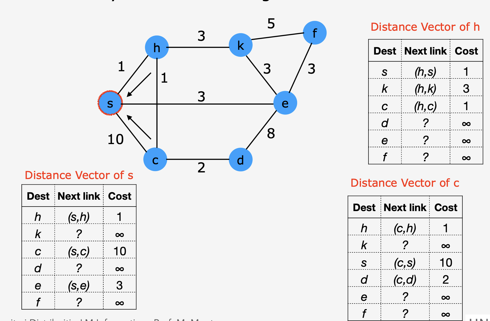
    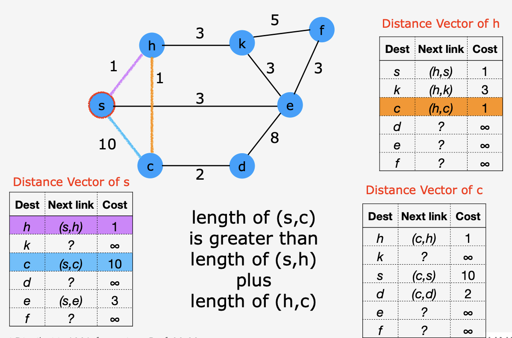

$$
\space
$$
> Questa sostanzialmente è la versione distribuita di Bellman-Ford: ad ogni iterazione troviamo i cammini minimi sempre più lunghi

### Costo

Essendo la versione di Bellman-Ford distribuita sappiamo che ci sono $n-1$ iterazioni poichè tutte le entità abbiano il cammino minimo corretto.

> in iterazioni diverse il distance vector può essere uguale a quello di prima

**Messaggi**: Ad ogni iterazione ogni entità $x$ manda la sua distance vector ($n$ valori) a tutti i $|N(x)|$ vicini
Il numero dei messaggi scambiati per ogni iterazione diventa $n \sum_x |N(x)| = 2nm$
il numero totale di messaggi diventa $O(n^2m)$

In questo caso tutti quanti hanno lavorato contemporaneamente di costruire la routing table, ma se ognuno singolarmente cercasse di costruire il suo albero dei cammini minimi in maniera distribuita. Mi devo ricordare così solo tanti archi quanti sono le entità (non quanti sono quelli del grafo).

## Routing Tables: coping with changes

**Problema**: Nella realtà spessso i costi (il tempo di percorrenza) di un link, può cambiare in base alle condizioni del traffico della rete; possono peggiorare/migliorare durante il tempo.

#### Gossiping 

Pensando all'algoritmo di prima, se pensiamo che ogni volta che i link cambiano le mappe diventano obsolete (non aggiornate). Bisogna fare una **map update**: tutti inviano nuovamente i loro costi, e ognuno deve ricostruire la propria mappa e rifare la tabella di routing.

Il vantaggio è che se tutti gli update vengono eseguiti, rimangono aggiornate e accurate per il tempo; lo svantaggio è che ci sono tanti messaggi che vengono scambiati e le varie entità devono tenere la mappa per evitare di ricostruirla ogni volta.

#### Distance Vector (Iterating)

In questo caso l'update è più difficile perchè localmente non hanno conoscenza di tutta la mappa:
- un caso drastico è: è cambiato qualcosa, rifaccio l'algoritmo da capo
- quello che vede un cambiamento è modificare il suo distance vector, progpagandolo come aggiornamento, così che invece di ricominciare da capo possono partire da una base. Se una entità riceve un distance vector nuovo confronta con il suo se è migliore propaga la modifica.

> in questo caso in alcuni momenti potremmo non utilizzare il cammino migliore: perchè l'algoritmo non è ancora arrivato a convergenza.

- Ricominciare da capo è troppo costoso, devo aspettare ogni volta che cambia di ricreare il distance vector
- Aggiornare è più veloce, non sappiamo mai quanto tempo ci impiega a convergere perchè durante l'aggioramento potrebbe cambiare nuovamente

> Nella realtà avere la tabella sempre con i costi migliori è troppo costoso

Rilassiamo il vincolo del cammino minimo, cerchiamo di trovare un percorso ragionevolmente bene però possiamo cercare di tenere le tabelle più aggiornate possibile, ma meno frequentemente per evitare di congestionare i link.

## Min-Hop Routing

Non sono interessato al cammino minimo, ma mi interessa sapere attraverso quante altre entità deve passare il mio messaggio prima di arrivare a destinazione; cerco di fare il minimo numero di Hop (salti): in questo modo sto cercandi di fare un albero BFS.

> Se ci mettiamo nel caso sincrono riuscimao a farlo con SHOUT, mentre nel caso asincrono non è garantita questa costruzione.

In questo caso la sorgente è quello che vuole costruire lo spanning tree dei cammini minimi, non mi preoccupo della sorgente singola perchè stiamo cercando di costruire lo spanning tree locale per l'entità.

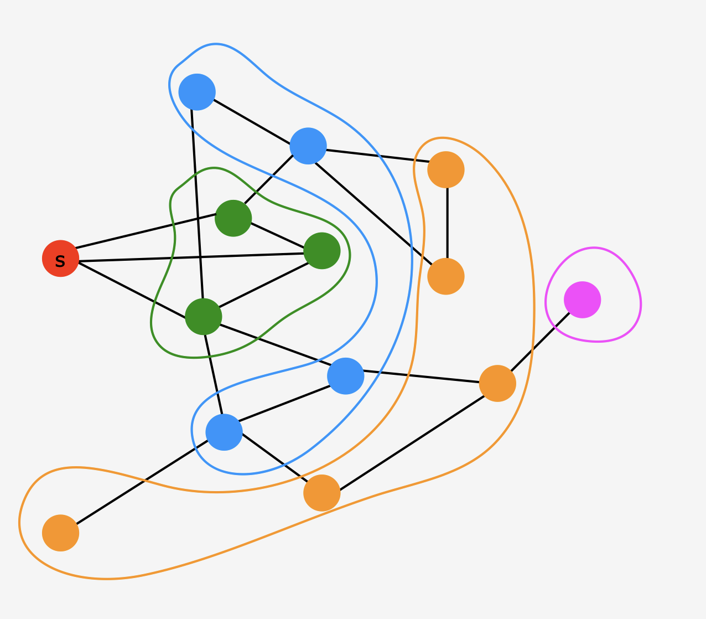

>Proprietà: se un nodo è a distanza $i$ da $s$. allora i suoi viini sono sia a distanza $i-1$ o $i$ o $i+1$ per determinare nodi a distanza $i+1$ solo i vicini deli nodi a distanza $i$ sono necessari

Può un nodo a livello $i$ avere un vicino $i-2$? non può avercelo, perchè dovrebbe essere a livello $i-1$

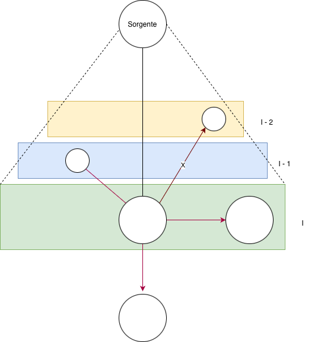

quando devo creare il livello $i$, gli unici che lavorano sono quelli dell'ultimo livello conosciuto ovvero $i-1$.

Bisogna trovare il modo per fare in modo che lavorino soltanto quelli che devono lavorare e un modo per capire quando quelli del livello interessato hanno finito di lavorare.

Che cosa può fare la radice per tenere sotto controllo la creazione dei livelli?
- a Livello 0 c'è soltato la radice e fa da sola
- Per gli altri sarà la sorgente a scandire il tempo delle prossime iterazioni
  - non solo dovrà dire quando iniziare, ma anche sapere quando quelli del livello hanno finito

Ad una generica iterazione $i$-esima:
1. l'albero parziale contiene le entità a distanza $i-1$ da $s$
2. le entità nell'albero conoscono la loro distanza da $s$ (= conoscono il loro numero di iterazione di quanto sono state incluse)

alla fine dell'iterazione $i$ abbiamo aggiunto quindi il livello $i$-esimo.

per la generica iteazione $i$:
1. la radice fa broadcast (sugli archi dell'albero ovviamente) "start iteration $i$" sull'albero
2. la generica entità $x$ nell'albero, se ricevono "start iteration $i$" 
   1. se la distanza è $\lt i -1 $: allora manda il messaggio avanti 
   2. altrimenti se siamo al livello $i-1$ manda il messaggio con un "exploring i"
      1. l'entità a distnza $i-1$ manda un "explore i" ai vicini (non i parent dell'albero) e aspettano una risposta:
         1. ack-ok: non ero un nodo nell'albero e divento tuo figlio nell'albero
         2. ack-ko: il no arriva da una entità vicina che è già nell'albero (stesso o un livello prima)
         3. explore i: arriva da una entità allo stesso livello
      2. per l'entità $y$ che non sono nell'albero, se ricevono il messaggio "explore i":
         1. la prima volta che lo ricevono, mandano un ack-OK e impostano come padre il mittente del messaggio "explore" e settano la loro distanza dalla radice a $i$
         2. per le volte successive manda un ack-KO.
   3. Quando il nodo a distanza $i-1$ riceve un ack da tutti i suoi vicini manda un "iteration i ended" al proprio padre
3. una generica entità $y$ che non è a distanza $i-1$ devono aspettare da tutti i figli "iteration i ended" prima di poterlo inviare al proprio padre (convergecast)
4. Quando arriva da tutti i figli della sorgente un messaggio "iteration i ended", si può far ripartire la nuova iterazione.
  
> In questo modo so per certo che avrò finito tutto il livello prima di iniziarne uno nuovo.

---

> Si potrebbe fare meglio, riducendo il numero di messaggi

- Evitiamo di mandarlo al "padre" e al vicino di livello $i-2$
  - visto che tecnicamente quando un nodo a livello $i$ può aver ricevuto un explore da più di un nodo di livello $i-1$, si ricorda anche quelli a cui ha risposto di no come vicini del padre
    - all'iterazione successiva quindi eviterà di mandare su quei link il nuovo explore $i$ così da evitare di mandarlo a nodi già presenti nell'albero a livello successivo
- Se si riceve un explore da un link al mio stesso livello (su cui io ho già mandato un explore) evito di rispondere con un ack-KO

---

Per sopperire alla mancanza di sincronizzazione aumentiamo il numero di messaggio.

Terminazione: la radice manda un segnale di terminazione a tutti.
La radice come fa a sapere quando termina?
- se abbiamo $n$ sappiamo che l'upper bound è al massimo $n-1$, ma non è un risultato soddisfacente
- nel momento in cui ad un nodo viene chiesto di scoprire "explore i" ma riceve tutti NO, allora manda un segnale per dire che è una foglia, da lì non si va avanti.
  - quando tutti i nodi figli della radice mi dicono che sono tutte foglie so che devo terminare.

> In questo caso il numero di iterazione è il minimo necessario per costruire l'albero

### Costo

**Messaggi**
In una generica iterazione $i$:
1. broadcast nel partial tree (fino alla distanza $i-1$) $ \rightarrow (n_i -1)$
2. explore
3. Covergecast per l'iterazione "iteration ended" $\rightarrow (n_{i} - 1)$
  
Sommando per ogni iterazioni

$$
\sum_{i=1}^{r(s)}(n_i + n_{i+1} -2) \leq \sum_{i=1}^{r(s)} (2n -2) = 2(n-1)\sum_{i=1}^{r(s)}1 \leq 2(n-1)D(G)
$$

>$r(s)$ è il raggio l'altezza dell'albrero BFS radicato in $s$

mancano anche gli "explore", guardando tutta l'esecuzione tutti i nodi fanno explore **esattamente una volta**, ovvero quando è nel livello che deve lavorare: per ogni nodo lui manda due messaggi, explore e ack.
$$
2 * deg(root) + \sum_{x\neq root}2(deg(x) -1) = 4m -n +1
$$

Mettendo tutti assieme ho che
$$
2(n-1)D(G) + 4m -n +1 \leq 2(n-1)(n-1) + 4m -n +1 \in O(n^2)
$$

> Con l'ottimizzazione vista precedentemente il costo dell'explore arriva a $2m$ poichè su ogni arco passano al più 2 messaggi, il costo si sposta comunque sullo spazio richiesto a mantenere in memoria i vicini del padre. Il costo asintotico comunque rimane nell'ordine di $O(n^2)$

**Tempo**

Il sistema è asincrono, dobbiamo contare la catena più lunga di messaggi, contiamo una iterazione poichè dopo si possono sommare visto che sono sequenziali.

- Il messaggio parte dalla radice (start iteration), fino al livello $i-1$
- Abbiamo explore $i$ che aggiunge 2 messaggi alla catena (explore - ack)
- poi abbiamo il ritorno convergecast
  

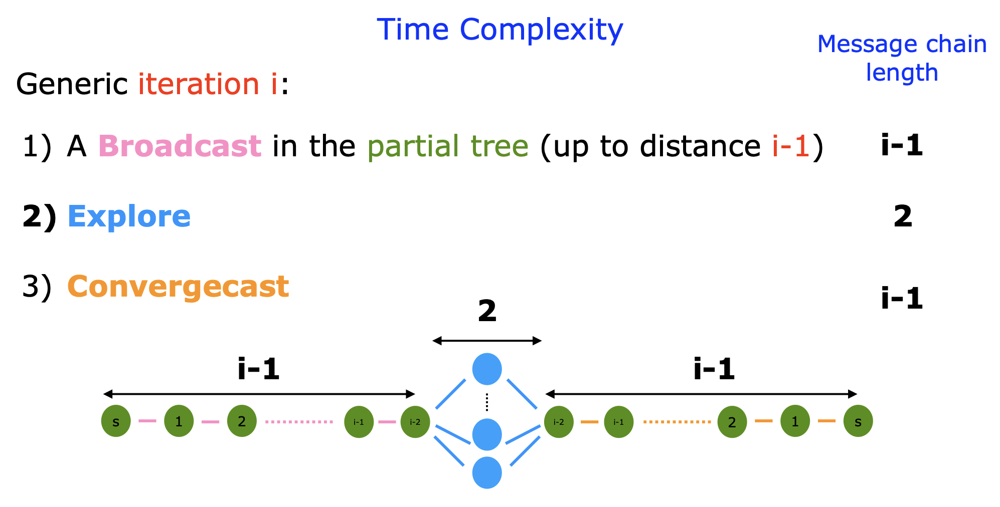

sommando tutto abbiamo che
$$
\sum_{i=1}^{r(s)}2i \in O(r(s)^2) \in O(n^2)
$$

> se ho una topologi del grafo riesco ad avere un calcolo dei costi più precisi

## Shortest Path Spanning Tree (DIJKSTRA)

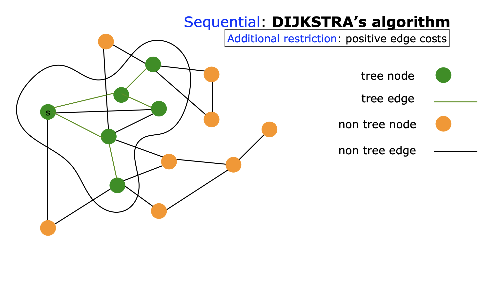

All'inizio della nostra itearazione abbbiamo:
- s che è la root del SPST
- alcuni nodi fanno parte del SPST
- gli altri nodi non sono all'interno dell'albero
  
> All'inizio l'unico nodo nell'albero è la sorgente e alla fine tutti i nodi faranno parte dell'albero

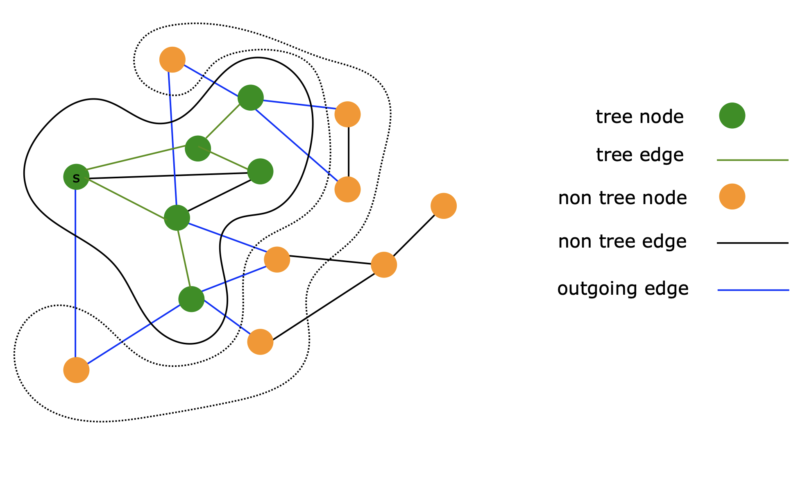

- Gli outgoung edges connetto i nodi dell'albero con quelli che non lo sono

> Anche qui si va ad iterazioni, ci deve essere qualcuno (la sorgente) che ha il controllo sullo start delle iterazioni

Ad ogni iterazione lavorano solo quelli che hanno un arco *outgoing*:
- sceglie quello con l'arco con il costo minore e lo notifica al padre
- il padre riceve da tutti i figli i nuovi costi e decide il minimo tra quelli ricevuti

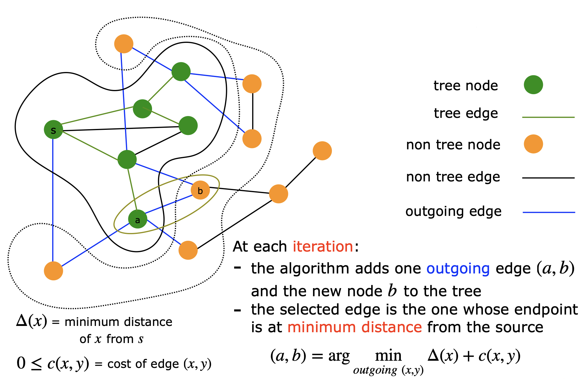

- la sorgente decide il minimo e avvisa il nodo scelto che diventa un nodo dell'albero
  - segnala ai suoi vicini che lui fa parte dell'albero
- rimanda la notifica finito alla sorgente, che poi può far ripartire 

**Fase di inizializzazione**:
1. tutte le entità settano tutti gli archi ad outgoing
2. tutti le entità si prendono informazioni di quanto costano gli archi incidenti
3. la sorgente si mette nell'albero
4. tutte le altre entità si mettono fuori dell'albero
5. la sorgente notifica i suoi vicini che lei è nell'albero
6. i vicini della sorgente impostano gli archi che li connettono alla radice li impostano a *NON-outgoing*

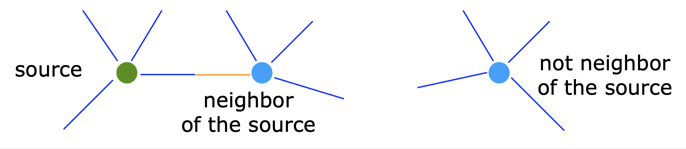

**Iterazione generica**:
1. la root fa broadcast "start iteration" all'albero (costo $O(n)$)
2. un nodo $x$ nell'albero che riceve uno "start iteration"
   1. se non ha outgoing edges, non fa nulla
   2. calcola $\Delta(x) + c(x,y)$ per ogni outgoing edge $(x,y)$
   3. selezione l'edge $(x,y_x)$ che minimizza il valore calcolato
3. le entità nell'albero calcolano $\hat x = \arg \min_x \Delta (x) + c(x,y_x)$ 
   1. la root aggiunge $(\hat x, y_{\hat x})$ e $\hat x$ all'albero
4. la root utilizzando i link del'lalbero notifica $y_{\hat x}$ della sua inclusione nell'albero e
   1.  $\hat x$ manda a $y_{\hat x}$ il valore $\Delta (y_{\hat x})$
   2. $\hat x$ e $y_{\hat x}$ selezionano l'arco che li collega come tree
5. l'entità $y_{\hat x}$ notifica i suoi vicini (tranne $\hat x$) che ora fa parte dell'albero e aspetta un ack
6. ogni entità $z$ vicina di $y_{\hat x}$:
   1. setta l'edge $(y_{\hat x},z)$ come *NON-outgoing*
   2. manda l'ack a $y_{\hat x}$
7. l'entità $y_{\hat x}$ quando riceve tutte le ack dai suoi vicini manda l'*end iteration* alla root

    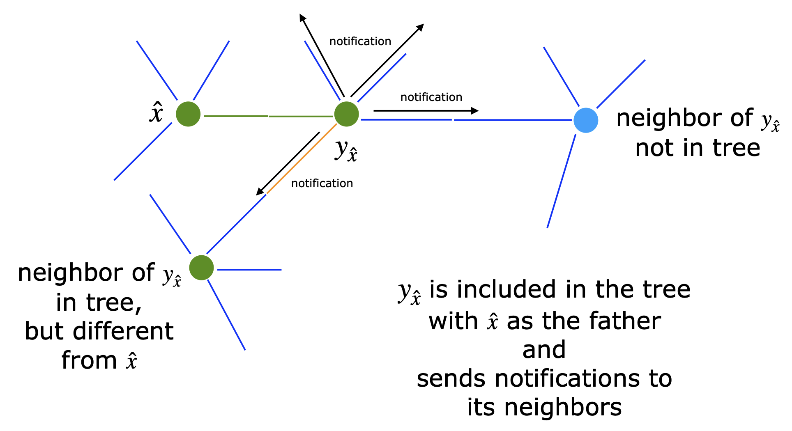
    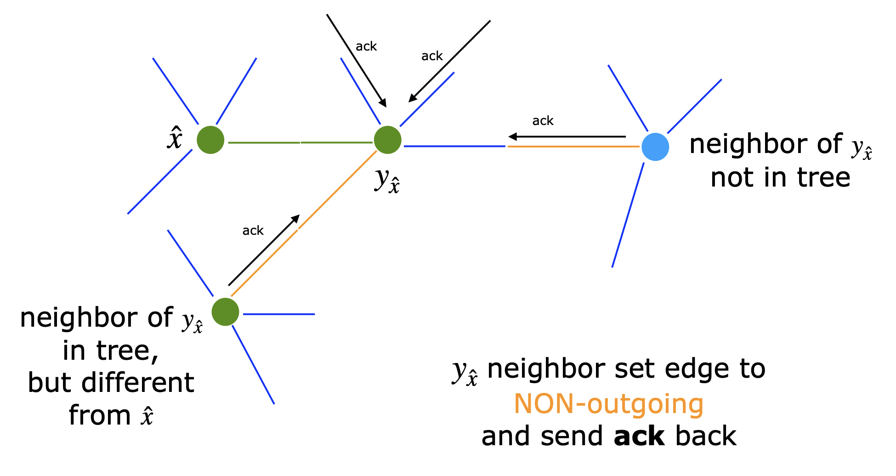

> Nella nuova itarazione $y_{\hat x}$ non prendera in considerazione i vicini già nell'albero ma solo quelli che non lo sono.

### Costo

**Messaggi**: 
ad ogni iterazione aggiungiamo un solo nodo all'albero SPST

Ad una generica iterazione $i$: abbiamo un albero parziale che ha esattamente $i$ nodi e l'iterazione finirà con $i+1$ nodi.
- broadcast "start iteration" $\rightarrow i-1$ messaggi
- convergecast $\rightarrow i-1$ messaggi
- notifica al nodo che è stato aggiunto $\rightarrow \leq (i-1) + 1$ messaggi
- notifica dell'end iteration $\rightarrow \leq (i-1) + 1$ messaggi

Per tutte le iterazioni (che sono $n-1$) abbiamo che:
$$
\sum^{n-1}_{i=1}(4i -2) = 4\sum^{n-1}_{i=1}i-2\sum^{n-1}_{i=1}1 = 4 \frac{(n-1)n}{2} - 2(n-1) = 2(n-1)^2 \in O(n^2)
$$

dobbiamo però aggiungere a questi messaggi:
- ogni nodo manda la notifica ai vicini
- ci sarà l'ack
- la root manda la notifica ai soi vicini per l'inizializzazione
  
$$
2 \sum_{x\neq root}(deg(x)-1) +deg(root) = 4m -2(n-1)
$$

che vanno sommati a quelli sopra e otteniamo sempre $\in O(n^2)$

**Tempo**

Abbiamo la strada della sorgente al nuovo nodo 4 volte:
- broadcast
- convergecast
- notifica
- end
A cui poi si aggiungono i messaggi di notifica di aggiunta del nuovo nodo ai suoi vicini

il nodo più lontano all'iterazione $i$ può essere al massimo a $i-1$.

in totale abbiamo $4(i-1) + 4 = 4i$ che diventa a suoa volta se iteriamo per $n-1$
$$
\leq 4 \sum^{n-1}_{i=1}i = 2(n-1) \text{ messaggi}
$$

> Siamo sempre nell'ordine di $O(n^2)$

## Costo della costruzione della routing table

Per i costi che abbiamo visto fino ad ora abbiamo che il costo di costruzione della routing table per 
|Algoritmo|Costo
|-|-|
|1 shortest Path spanning tree| $O(n^2)$|
|n shortest path spanning tree | $O(n^3)$|

che per il costo dei messaggi diventa

|Algoritmo|Costo|Worst Case|
|-|-|-|
|Gossip|$O(mn)$|$O(n^3)$|
|Iterating|$O(mn^2)$|$O(n^4)$|

