# Computing with Faults & Failure

ma a casa

Nella realtà non esiste la Total reliability, quindi ci mettiamo in un caso reale in cui è possibile che ci siano fallimenti.

Classifichiamo per:
- **CAUSA**
  - *execution faults*: durante l'esecuzione di una entità
  - *transmission faults*: derviante dal malfunzionamento durante la trasmissione
  - *component faulure*: entità o liink che vengono disattivati o spenti
- **Durata**
  - *Transient faults*: compare e scompare (per suo conto)
  - *Permanent faults*: quando scompare fino a che non viene sistemato
- **Estensione**:
  - *Locali*: solo un numero (non conosciuto) di componenti è predisposto a fallire
  - *Ubiquitous*: tutti i componenti potrebbero eventualmente avere un fault

È difficile riuscire a progettare un protocollo che sia resileiente a qualsiasi fallimento (es. se fallisce tutto è impossibile avere un algoritmo che funziona se non c'è niente che funziona).

Se alcuni tipi di fallimenti li riesco a percepire si riesce a risolvere.

Quello che succede nella teoria e quello di dire che abbiamo un sistema e quali sono i tipi di fallimenti che ammettiamo e progettare un protocollo che resiste a fallimenti di quel tipo e quanti fallimenti possono accadere.

Le ipotesi aggiuntive sono:
- i fallimenti che possiamo gestire
- quanti fallimenti riusciamo a gestire

> Dobbiamo avere un modello dei nostri fallimenti per poterli descrivere al meglio, spesso non sono completamente realistici.


**Componenti che possono fallire**
I tipi di fallimento possono essere:
- *Entità*, soltanto le entità possono fallire (qualche tipo)
- *Link Failure*, soltato i link possono fallire
- *Hybrid Failure*, sia l'entità che il link possono fallire

> Noi ci concentreremno solo dei primi due casi e dove i fallimenti sono permanenti

Quali sono i tipi di fallimenti che possono avere le entità (dal meno al più pericoloso):
- *crash*: una entità smette di funzionare improvvisamente e non riprenderà più
- *send/recive omission*: fallisce nello spedire o nel ricevere (non perchè il link fallisce, ma per un suo problema)
- *bizzantino*: una entità che si comporta come gli pare, ogni tanto segue il protocollo, ogni tanto no, ogni tanto fa finta di crashare, ogni tanto fa qualcosa fuori dal protocollo. Questo simula oltre un comportamento di intrusione.

Mentre ai Link:
- Omissione: un messaggio che viene spedito non arriva a destinazione
- Addizzione: comparire un messaggio che nessuno aveva spedito
- Corruzzione: il messaggio arriva corrotto
- Bizzantino: il comportamento formato dai tre precedenti a caso

> Ogni volta diremo in quale situazione ci troviamo, anche ibrido

C'è una correlazione stretta a quello che si riesce a fare tra i protocolli resilienti e la topologia del grafo, perchè fare una operazione base come facevamo prima (come il broadcast) richiede che la rete sia connessa. Se si disconnette un ramo, potrei avere un sottografo che non è più raggiungibile e non posso nemmeno fare broadcast.

In questi casi dobbiamo sapere quanti sono i fallimenti della rete, per sapere quanto è grande il "danno", magari ci sono situazioni in cui non è nemmeno sensato provare. 
Abbiamo due discrizini che ci aiutano:
- Edge connectivity: minimo numero di link che se rimossi disconnettono il grafo
- Node connectivity: minimo numero di nodi che se rimossi disconnettono il grafo

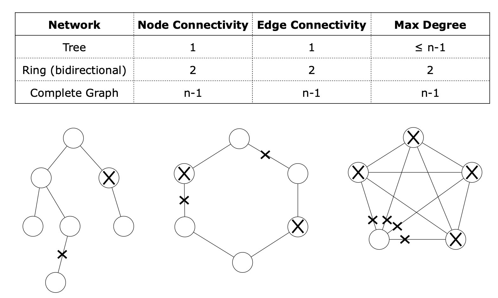

> in generale $\text{node connectivity} \leq \text{edge connectivity} \leq \text{max degree}$

Prendendo il caso più semplice di link e entità c'è una strettissima connessione tra nodo ed edge connectivity:

> se arbitrari $k$ link possono crashare è impossibile fare il broadcast a meno che la rete non sia ($k+1$-edge-connected)

> se arbitrari $k$ nodi possono crashare, è impossibile fare il broadcast a meno che la rete non sia ($k+1$-node-connected)

## Agreement and Consensus

### p-Agreement Problem

**Input**: ogni entità $x$ ha in input un valore $v(x)$ estratto da un set di valori

**Output**: almeno $p$ entità devono essere d'accordo (agree) sullo stesso valore $d(x)$ dal set in un tempo finito

Quello che rende complicate le cose è la proprietà di *Non Triviality*: se tutti i valore sono inizializzati uguali allora la decisione deve avere quel valore lì

Il p-agreement diventa il problema del consenso quando tutti devono avere lo stesso valore, non un sottoinsieme.

**Esempi**
- Distributed Database: essere d'accordo sul risultato di una transazione (es. banca)
- Diagnostic: Essere d'accordo se un componente della rete è rotta o no
- Voting: Essere d'accordo su una misura esterna letta da più sensori (es. sensori dell'altitudine sugli aerei)

### Consensus problem

**Input**: ogni entità $x$ ha un valore di input $v(x)$
**Output**: tutte le eintità devono decidere un valore $d(x)$

Le decisioni sono soggette ai seguenti constrains:
- Agreement: tutte le entità devono dire lo stesso valore
- Non triviality
- Termination

> Siamo nel caso in cui solo i link possono fallire

#### Two Generals' Tale

Questo può essere raccontato come una storia: pensiamo a due generali che sono su due colline da una parte della vallata e sanno che il nemico passerà dalla vallata: entrambi sanno che da soli non riusciranno a sconfiggere il nemico, ma se partono insieme possono riuscirci. 
Quindi a un certo punto dovranno decidere se attaccare e farlo contemporaneamente, o non farlo.

Il generale A decide che il miglior tempo è la sera e deve comunicarlo al generale B senza utilizzare un metodo con cui il nemico potrebbe vedere.

Il generale A manda un povero messaggero dal generale B per avvisarlo della decisione, però l'esercito che sta arrivando, non lo fa senza aver mandato un esploratore, è possibile che questo messaggero incontri il nemico e venire intercettato.

Se al generale B arriva il messaggio come fa a comunicarlo al generale A che sa benissimo che il messaggero potrebbe non sopravvivere? Manda nuovamente indietro il messaggero a dire che è arrivato il messaggio.

Il generale B non sa se il messaggero è arrivato o meno, quindi deve inviare nuovamente il messaggio.

Quando attaccano? Mai

Il problema è che chi invia il messaggio in generale non sa se è arrivato o meno.

> il problema dei due generali non ha una soluzione neanche nel caso dei sistemi sincroni

##### Theorem proof

in ogni esecuzione ogni solizione del protocollo nel quale i due generali decidono di attaccare, almeno un messaggio deve essere consegnato

Altrimenti è impossibile per il generale B distinguere:
- Generale A decide di non  attaccare
- Generale A decide di attaccare ma non è arrivato il messaggio

Assumiamo per assurdo che:
1. esista una soluzione al protocollo per il problema e
2. il link consegna almeno un messaggio prima di fallire

Considera l'esecuzione E di un protocollo che porta ad attaccare con un numero minimo di messaggi $k \ge 1$

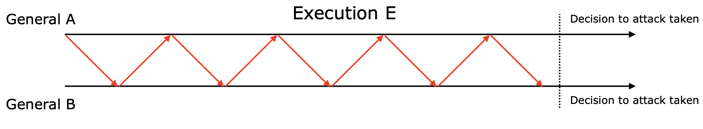

consideriamo l'esecuzione E' che è esattamente come E tranne che l'ultimo messaggio viene perso per una link failure

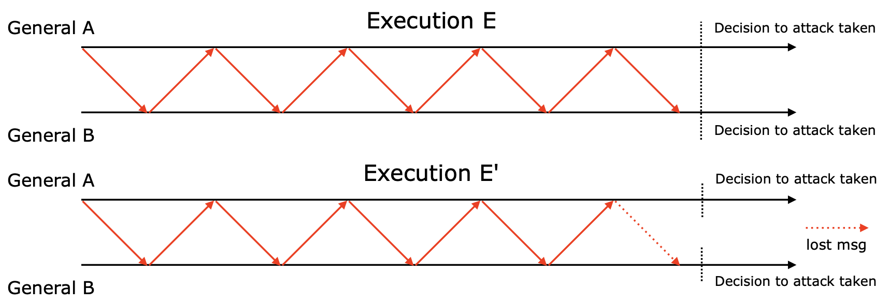

Per il generale A è uguale l'esecuzione E e E': il generale A decide di attacare, e ugualmente fa il B.

Quindi i due generali hanno attaccato con $k-1 \ge 0$ messaggi.

Qui c'è la contraddizione: se $k-1 \gt 0$ l'esecuzione E richiedeva un numero minimo di messaggi per decidere l'attacco, mentre la E' lo fa e non lo rispetta

se $k-1 = 0$ è una contraddizione perchè hanno deciso di attaccare senza uno scambio di messaggi!

---

### Consensus problem whit link failures

**Teorema**: se per ogni $F \gt 0$ link possono fallire, il consenso non può essere raggiunto se la rete non è ($F+1$)-connected anche se il sistema è sincrono

> Assumiamo un numero ammissibile di link failure non maggiore della edge connectivity

a questo punto la rete è connessa e posso fare *braodcast*

Il protocollo di broadcast di Flood continua a funzionare perchè la rete non è disconnesso, con gli stessi costi:
- MSG complexity $\leq 2m$
- Time complexity $\leq$ diametro del grafo con i faulty link

abbiamo un protocollo di consenso che funziona:
1. tutte le entità fanno broadcast del proprio valore
2. ogni entità calcola (lo stesso) semplice funzione sulla ricezione del valore (es. minimo/massimo - così soddisfiamo anche la Non triviality)
3. tutte le entità si danno ragione sul risultato della funzione

#### Grafo completo

> Broadcast foold funziona su tutti i grafi, ma sul grafo completo c'è uno spreco di messaggi (nel caso in cui non ci siano fallimenti).

Ma con i fallimenti? è vero che se uno manda a tutti il messaggio arriva a tutti anche con un solo link che fallisce? 
- No 

anche se è minore della edge connectivity se utilizzassimo questo protocollo basterebbe un link fallito giusto e il messaggio non arriva a tutti

> Assumiamo che ci sono al massimo $F \lt n-1$ link che falliscono e $F$ è noto da $x$ che vuole fare broadcast di $I$

**Due step**:
1. $x$ manda $I$ a $F+1$ vicini
2. una entità che riceve il messaggio da $x$ smandano il messaggio a tutti quanti i loro vicini (tranne da colui che glilo ha inviato)


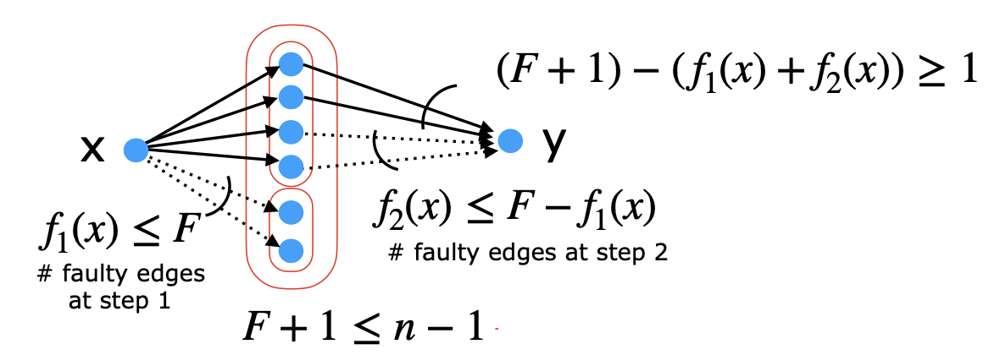

- Ogni nodo ha almeno un non faulty link: $(F+1) - (f_1(x)+ f_2(x)) \ge 1$
- ci sono sempre abbastanza vicini distinti di $x$: $F+1 \leq n-1$

**Messaggi**: al più
$$
(F+1) + (F+1)(n-2) = (F+1)(n-1) \in O(Fn)
$$


### Leader election in complete graph with link failure

Il problema è proprio uguale a quello del consenso: devono tutti decidere lo stesso Leader con le seguenti restrizioni

- Start Contemporaneo
- ID univoci
- $F \lt n-1$ conosciuto

> conoscendo la topologia sanno quanti vicini hanno e quindi sanno $n$
  
**FT-BoradElection**:
1. ongi entità madna in broadcast il proprio ID (con TwoSteps)
2. ogni entità calcola il minimo e decide se essere il Leader o un Follower

**Messaggi** Al massimo:
$$
n(F-1)(n-1) \in O(Fn^2)
$$

### Entity fault

Ora ci mettiamo invece nella situazione in cui i Link non possono fallire, ma invece le entità sì.

> TEOREMA: È impossibile raggiungere il consenso anche se:
> - c'è al massimo una entità faulty
> - la tipologia di fault sono crash
> - con una node connectivity $n-1$ (rete completa)
> con un protocollo deterministico in una condizione asincrona

**L'idea dietro la prova**

Ogni enetità che sta comunicando e aspretta dagli altri un messaggio, non ha modo di capire se l'entità che deve inviargli il messaggio è crashata oppure il messaggio sta arrivando. Non abbiamo un limite superiore al tempo che deve aspettare l'entità.
Nella pratica si mette un TimeOut: faccio delle assunzioni che possono non essere vere.

Possiamo lavorare quindi in situazioni migliori, mettendoci in un sistema con più restrizioni:
- posso lavorare in un sistema sincrono
- posso lavorare in un sistema non deterministico
- posso avere un detector di fault (poco possibile lo stesso)

Quello che andremo a vedere nel solo caso di **crash** sistemi *sicroni* e nel caso del *non deterministico* (una delle due basta per uscire dal teorema)

### Consenso Con Entity Fault in un sistema Sincrono

**Restrizioni**:
- Grafo completo
- strong connectivity
- Sincrono
- Tipo di fallimento solo crash
- inizio simultaneo
- conoscono $f$

> è possibile creare protocolloche che arrivano al consenso tollerando fino a $f\lt n$ crash

assumiamo che $v(x) \in \{0,1\}$ per ogni entità $x$

**Idea**: 
- è un protocollo che lavora a step, sono $f+1$, da $0...f$ 
- ad ogni step ogni entità manda in broadcast un report a tutti quanti i vicini e li riceve.
  - quando sono stati inviati i report e sono stati ricevuti tutti calcolano il prossimo report
- Il primo report è il valore dell'entità
  - il secondo report è il proprio report in AND con tutti i valori che gli sono arrivati

$r(x,t) = \text{x Report at time t}$

Se non mi arriva il report da una entità essendo nel caso sincrono so che è possibilmente crashata, allora metto $1$ (elemento neutro dell'end).

- $r(x,0) = v(x)$

```rust
TellAll_Crash(x)

for t = 0 to f
  compute r(x,t)
  send r(x,t) to N(x)
decide for r(x,f+1)
```

**Costo dei messaggi**: nel caso peggiore non ci sono crash, abbiamo
$$
(n-1)\text{ msg} * n \text{ nodi} *(f+1) \text{ steps} \\
n(n-1)(f+1) \in O(n^2f)
$$

**Costo di tempo**: $(f+1) \text{ time uints } \in O(f)$

**Esempio**

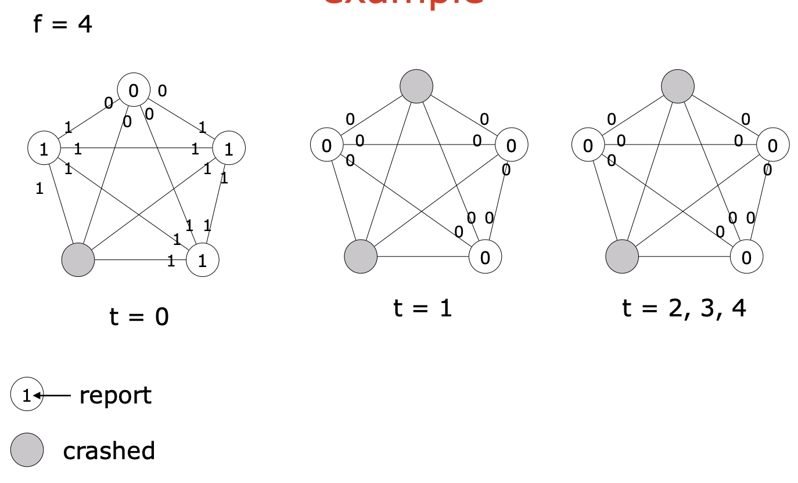

> Proprietà: se un entità non faulty riceve uno 0 al tempo $t\leq f$ allore tutte le entità non faulty riceveranno uno 0 al tempo $t+1$

> Proprietà: se una entità non faulty riceve uno 0 durante la sua esecuzione, allora decideranno per lo 0

> Proprietà: se tutte le entità iniziano con 1, tutte le entità non faulty decideranno per 1

Unendo queste proprietà possiamo dire che:

Tutte le entità non faulty decideranno 0 se almeno una di loro ha iniziato con 0 e tutti decideranno 1 se tutte le entità iniziano con 1.

Questo ci conferma la *Non-triviality*: in questo caso non è molto difficile dimostrarlo.

**Agreement** 

se almeno uno non faulty inizia con uno 0, allora tutti i non faulty inizieranno con 0. se tutte le entità iniziano con 1, tutte le non faulty dedicono per 1. Cosa succede se tutte le enetità non faulty iniziano con 1 e almeno una entità faulty inizia con 0?

Se l'entità faulty riesce a non crashare al primo step allora le altre entità vedranno uno 0 e si raggiungerà il consenso. L'unico motivo per cui un faulty non riesce a mandare (a tutti) il report è se crasha tra l'invio di un messaggio e l'altro.

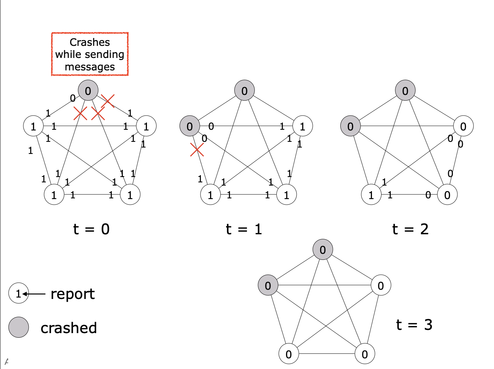

In un sistema distribuito tollerante ai guasti, se fino al tempo f tutti i nodi corretti vedono esclusivamente il valore 1, ma al passo successivo solo una parte di essi riceve improvvisamente 0, il protocollo non sarebbe più in grado di garantire l’accordo. Tuttavia questo non può accadere

**Assumiamo**
che fino al tempo $f$ tutte le entità non faulty hanno ricevuto solo 1 E che al tempo $f+1$ alcune entità (non tutte) hanno ricevuto uno 0.

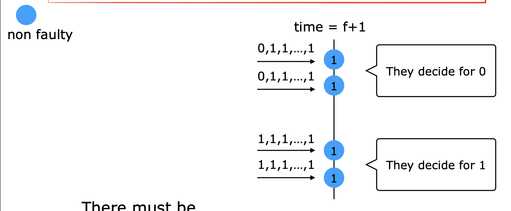

L'unica possibilità per cui sia successa questa situazione è che abbiamo ricevuto lo 0 da un faulty, e se lo manda ad alcuni ma non a tutti vuol dire che è crashato nel mezzo

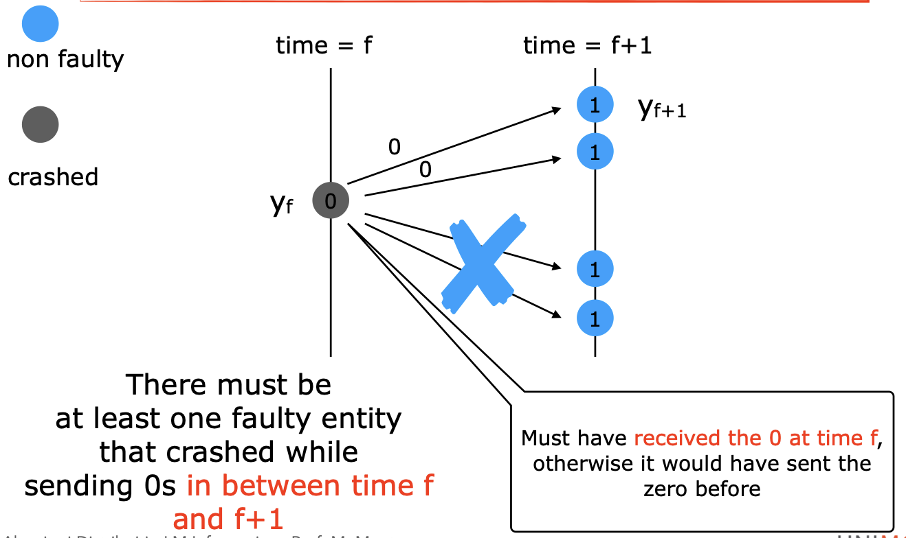

Guardiamo durante l'esecuzione i nostri istanti di tempo

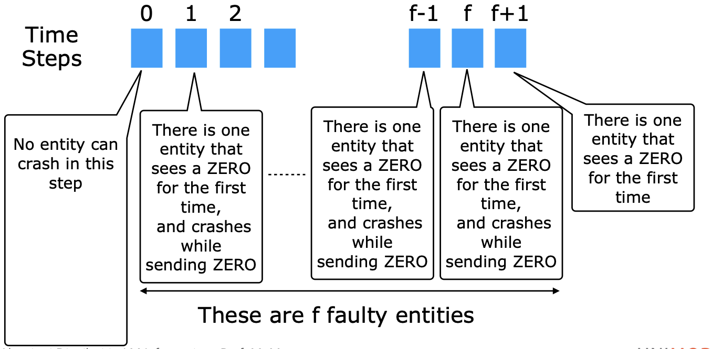

c'è una contraddizione: sappiamo che possiamo avere al massimo $f$ entità faulty, quindi possiamo andare indietro al massimo fino 1, quello che lo vede per la prima volta all'istante 1 non possiamo fare lo stesso discroso: all'istante 0 tutti devono lavorare, nessuno può crashare.
Cosa succede all'istante 0:
- nessuno può crashare
- chi ha lo 0 manda a tutti perchè non può crashare
- tutti vedranno uno 0 all'istante di tempo successivo

È quindi impossibile che al tempo $f+1$ una entità riceva lo 0. Allora vuol dire che non esiste neanche uno 0 (e che quindi tutti partono con 1) allora è impossibile che qualcuno veda uno 0. Siamo arrivati ad un assurdo perchè non possono partire ne con 0 ne con 1, quindi è impossibile che ci sia una entità che vede lo zero per la prima volta uno 0 e che gli altri non lo vedano.

Funziona perchè abbiamo un numero sufficiente di iterazioni, aggiungendo un ultima iterazione alla fine $f+1$ faccio in modo che tutti vedano un ipotetico 0. 

> Il protocollo termina correttamente dopo $f$ iterazioni, che magari sembrano inutili perchè dopo un po' si scambiano solo 0, ma serve ad evitare questo caso

**Agreement**:
- Se almeno un’entità non faulty parte con 0, tutte le entità non faulty decideranno per 0.
- Se tutte le entità partono con 1, tutte le entità non faulty decideranno per 1.
- Se tutte le entità non faulty partono con 1 e almeno una entità faulty parte con 0, allora tutte le entità non faulty decideranno per 0, a meno che tutte le entità faulty con valore 0 non vadano in crash prima di inviare qualsiasi messaggio.

Possiamo ridurre il numero di messaggi di questo protocollo?

> Osservazione: una volta che uno ha ricevuto uno 0 non è più necessario mandarlo avanti.

**Idea**: mandare l'1 è inutile, mando lo 0 (solo se visto) almeno una volta. ci mettiamo comuqnue $f+1$ round.

**Costo Messaggi**: $\leq n(n-1) \in O(n^2)$
**Costo Tempo**: $(f+1) \in O(f)$ Uguale a prima.

Quello che si può fare con questo protocollo è generalizzarlo (rimanendo nel sincrono):
- cambiando i valori 0/1
- avere uno start non simultaneo
- per un grafo generale G, il problema può essere risolto se $f \lt C_{\text{node}}(G)$


### Consenso in un sistema non deterministico e asincrono

**Restrizioni**:
- Strong Connectivity
- Grafo Completo
- Tipologia di fallimento: Crash
- conoscenza di $n$ e $f$

> È possibile creare un protocollo randomico che arriva al conesnso tollerando al massimo $f \lt \frac{n}{2}$ crash in un sistema asicrono.

assumiamo sempre di scegliere tra $v(x) \in {0,1}$

#### Ben-Or's (randomized) protocol (1983)

Il protocollo lavora in round, e siccome siamo in asicrono ogni entità avrà il suo round, e per far si che si possano sicronizzare in questo senso i messaggi hanno una label con il numero del round.
L'entità quando riceve un messaggio dal vicino:
- se gli arriva un messaggio dello stesso round $r$ allora lo usa
- se gli arriva un messaggio del round precedente allora lo ignora
- se gli arriva un messaggio di un round a cui non è ancora arrivato lo salva per dopo

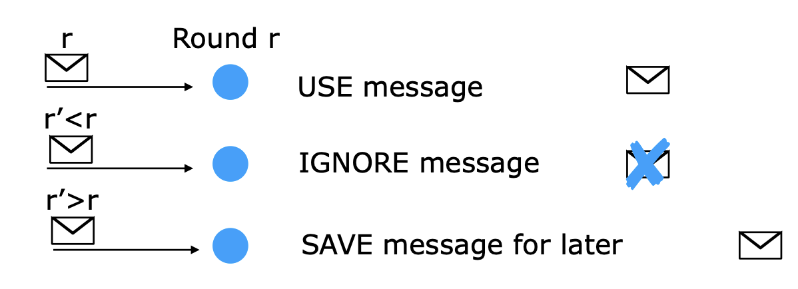

> Teniamo conto che quando uno fa broadcast in questo caso manda il messaggio anche a se stesso (non contato nel conto dei messaggi spediti)

**Idea**:
Ogni round cosiste in due passi:
- Propose: l'entità fa una proposta su un valore che deve essere accettato
- Adapt: riceve le proposte dagli altri e l'entità decide di scegliere un nuovo valore da proporre il prossimo round
  - ci sono casi in cui non si mettono d'accordo durante l'adapt allora sceglieranno randomicamente

> In questo caso il protocollo non finirebbe mai, si può modificare per arrivare alla terminazione, ma l'analisi risulta più facile farla in questo modo

```rust
r := 1
while true do
//PROPOSE
  Broadcast MyValue(r,xi)
  wait for n-f MyValue msgs of round r to arrive
  if at least n/2 + 1 msgs contain the same value x
    then
      Broadcast Propose(r,x)
    else
      Broadcast Propose(r,?)
//ADAPT
  wait for n-f Propose msgs of round r to arrive
  if at least 1 Propose(r,y) (y != ?) arrives
    then
      xi := y
      if at least f+1 Propose msgs contain the same value y
        then
          decision := xi
    else
      randomly chose xi with Pr[xi = 0] = Pr[xi = 1] = 1/2
  r := r+1
end while
```

<div style="display: flex; justify-content: space-around; padding-bottom:1.5rem;">
    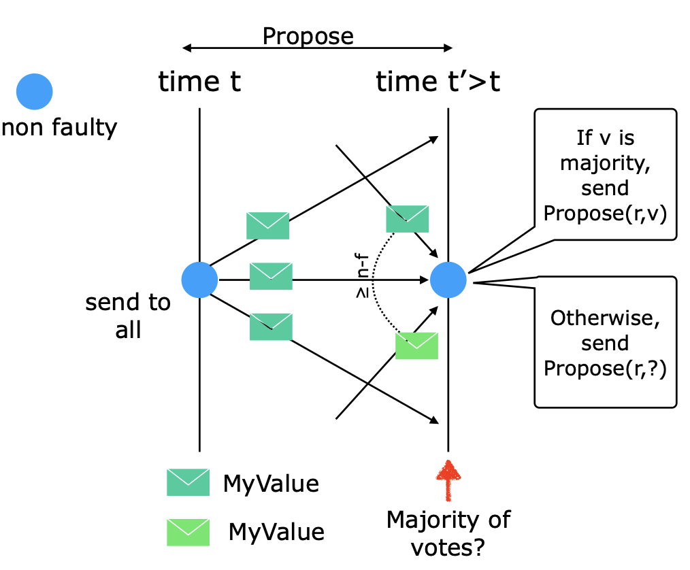
    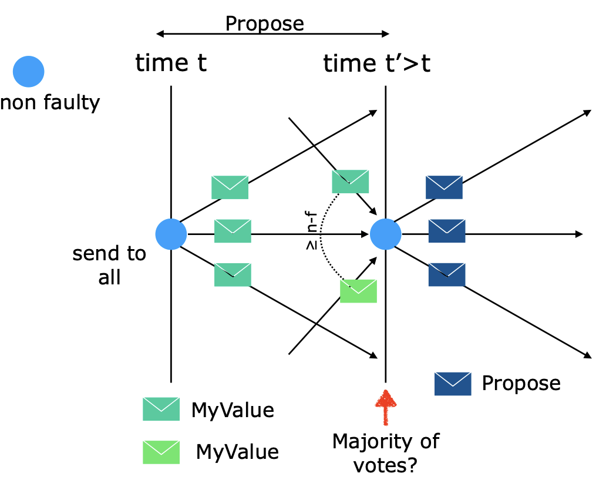
    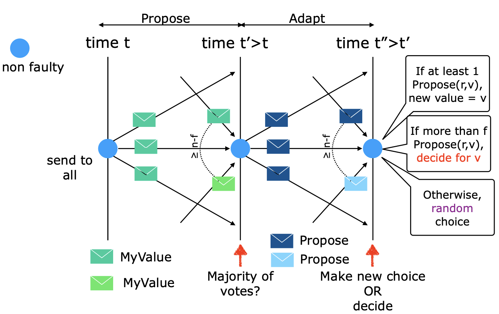
</div>

> Una volda che c'è il DECIDE FOR V è il vaore definitivo della scelta, servirà fare un round in più per far terminare il protocollo