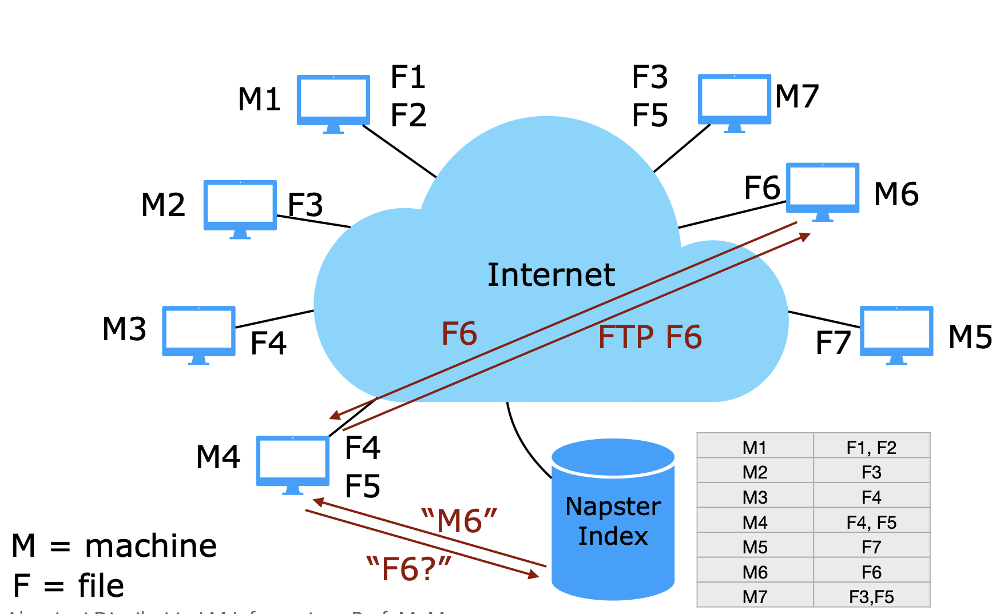
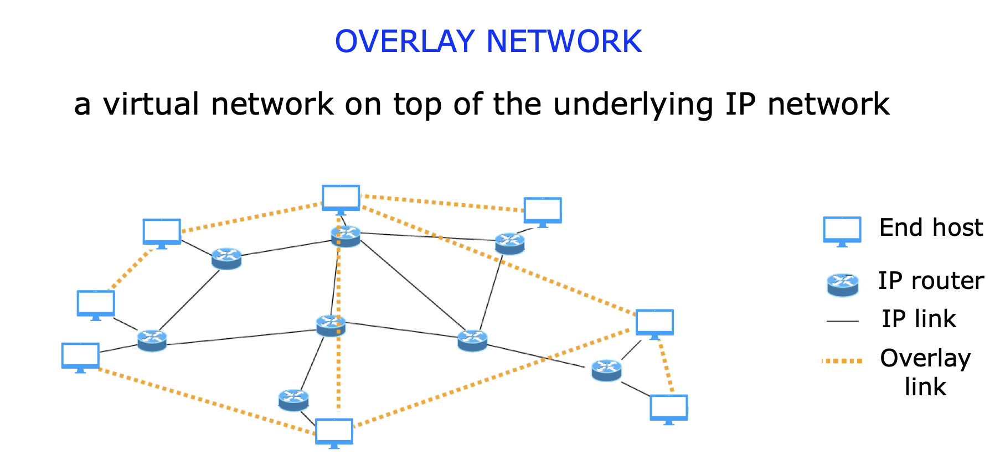
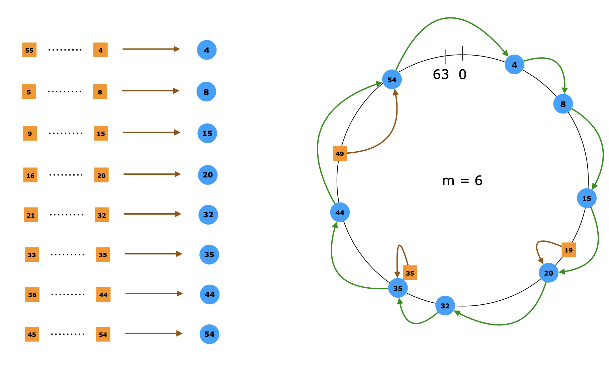
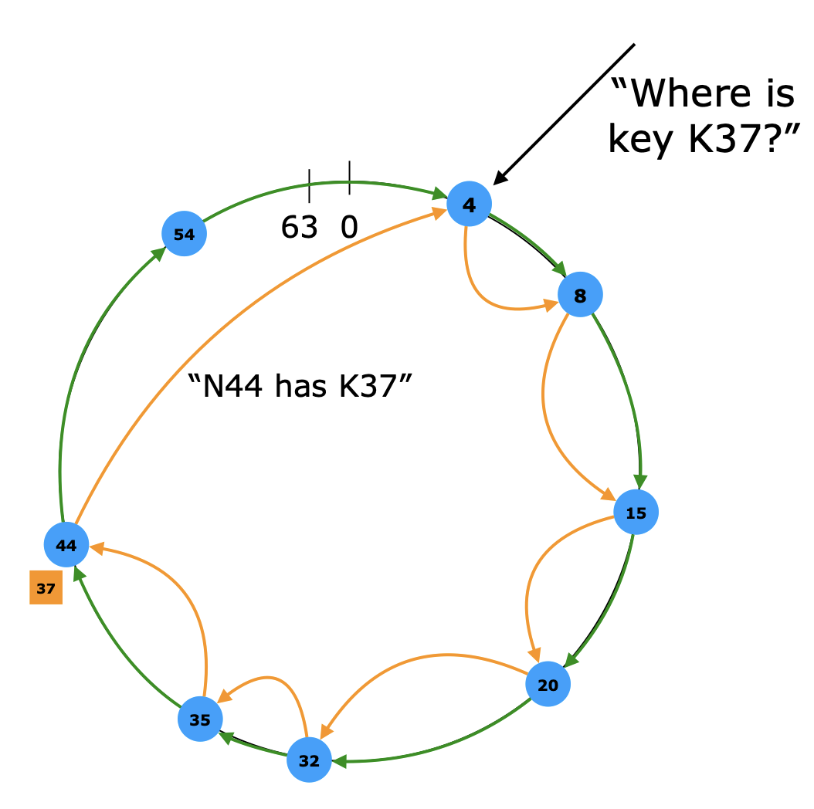
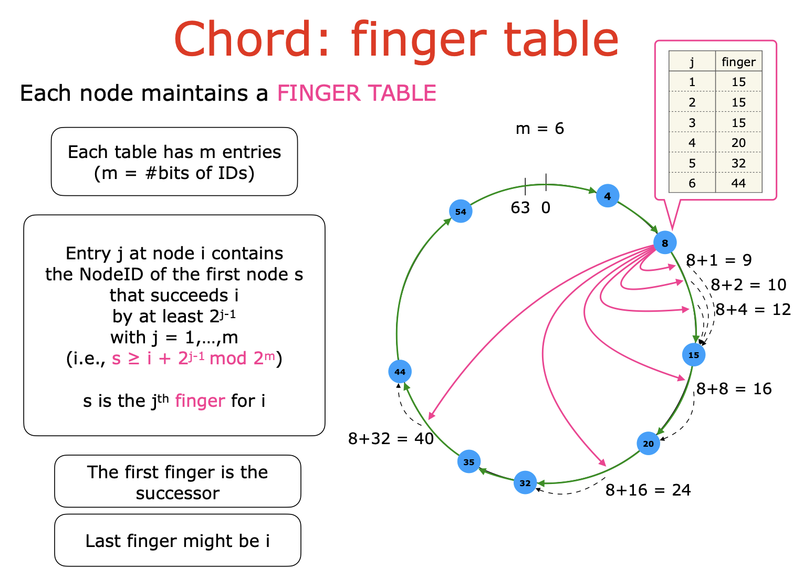
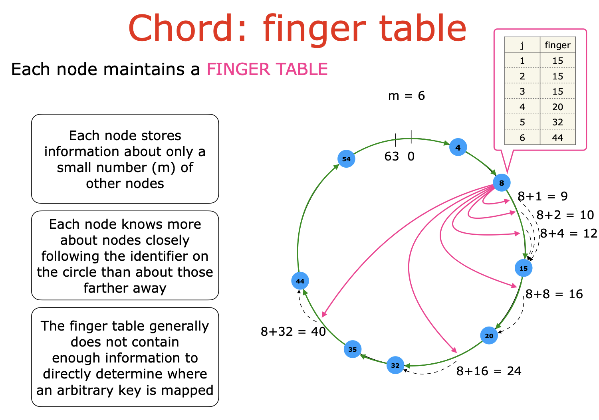
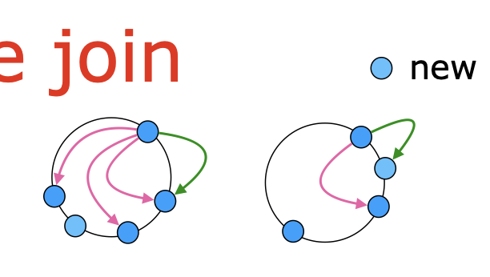
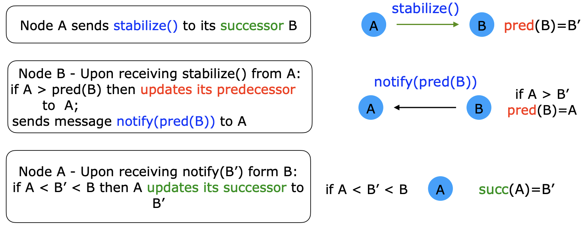
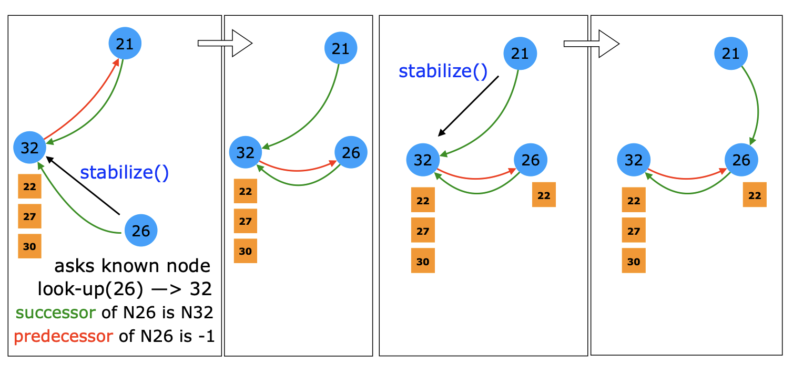
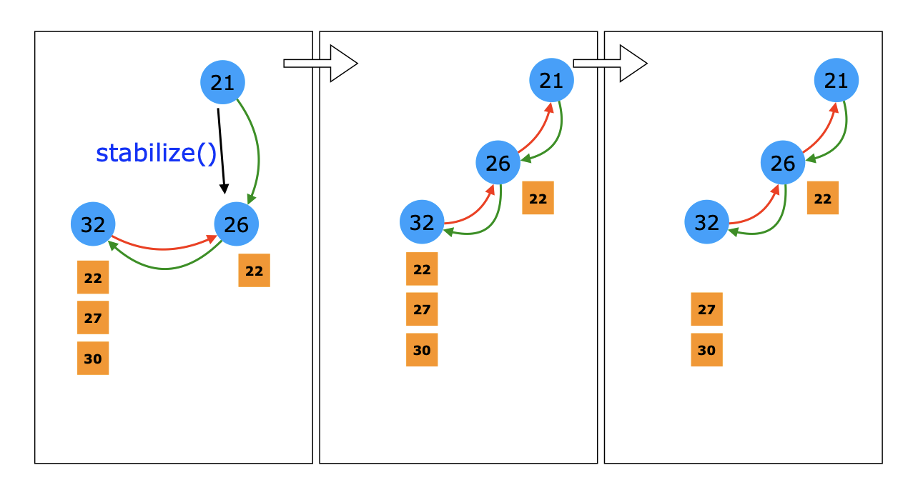

# Scalable Distributed Data Structures

- **Distributed data structures**: le entità di un sistema distribuito deve utilizzare una struttura dati
- **Scalable Distributed Data structures**: il numero di enttià non è fissato e può aymentare, aggiustando le dimensioni

## Hash Tables

ci permette di immagazzinare coppie di valori `(k,v)` dove:
- `k` è la chiave dell'universo `U`
- `v` è il valore (satellite)

Le primitive spesso sono:
- `insert` per inserire una coppia nella tabella
- `seach` per chiave (look up) nella tabella e restituisce il valore `v`
- `delete` un valore asssociato alla chiave `k`
  
Una implmentazione solitamente dervia da un Array, l'indice dell'array solitamente è mappato tramite una funzione $h$ di hash. Può essere che due valori capitino nello stesso indice, in questo caso ad ogni indice dell'array noi ci teniamo una lista, così da non perdere dati nelle sovrapposizioni

Come rendiamo distribuita questa struttura dati? dove possono anche dinamicamente cambiare?

## Storia del distribuito

fondamentalmente vogliamo distribuire le coppie `(k,v)` invece che in un array nei nodi, ogni entità quindi avrà una parte delle coppie. Quando cerco una coppia quindi devo sapere qual'è il nodo che contiene quella coppia.

#### Napster

**Idea**: condividere contenuti, spazio e banda di un singolo utente.
- Ogni macchina di un utente tiene in memoria un subset dei file
- Ogni utente può scaricare i file da tutti gli utenti nel sistema

L'idea è stata quella di avere un Indice centralizzato che fondamentalmente teneva memorizzato per ogni macchina che era attiva, che file erano presenti, oltre a questo teneva anche conto di chi era online o no.

**vantaggi**: 
- facile da implementare con un sistema di ricerca centralizzato e veloce
- dal punto di vista dell'utente il carico dell'utente era ideale (teneva solo quello che voleva lui)
- il server centrale ha il completo e consistente visione del sustema
- il sistema era sempre corrett

**svantaggi**:
- Scalabilità: un indice centralizzato che gestiva tutte le query
- Robustezza: sistema cetralizzato era un signle point of faulure, se l'indice non era attivo il sistema non andava
- Non c'era garanzia sulla correttezza del file (derivavano dalla user information)

> Non è che fosse molto legale ridistribuire la musica

#### Gnutella

Quando si sono accorti dei problemi legali di questo serve centralizzato (su cui si poteva scaricare tutta la colpa):

**Idea**: non c'è più un server centralizzato, ogni macchina è un server e un client allo stesso tempo
- per entrare nel sistema la macchina deve conoscere almeno un altro nel sistema
- ogni machcina contiente un subset di tutti i file
- ogni macchina è connessa ad un numero limitato di vicini
- A query is recursively sent to all neighbors for a maximum number of hops (TTL = Time To Live), those machines that have the file send an answer back
- File is downloaded using HTTP

Il modo di cercare un messaggio era semplicemente chidere ai vicini che a loro volta se non lo avevano facevano richiesta ai loro vicini, un po' come il Flooding con un TTL.

**Vantaggi**:
- Completamente distribuito
- Robusto al fallimento dei nodi
  
**Svantaggi**:
- Scalabilità: rete intasata dai messaggi
- derivante dal TTL non è detto che trovi il file

#### KaZaA
**Idea**: ibrido, organizzare le macchine gerarchicamente, ci sono due tipi di nodi:
- Ordinary Nodes (ON): 
  - macchine normali dell'utente
  - appartiene a un solo SN alla volta
- Super Node (SN):
  - macchine runnate da utenti con più responsabilità
  - funzionava come un index di napster

Per cercare un file (è un mix di quello di prima):
1. ON manda un richiesta al SN
2. il SN risponde agli ON e fa forward della richiesta ad altri SN
3. gli altri SN rispondono per i propri ON

**Vantaggi**:
- Ricerca efficiente con i SN
- Flooding ristretto agli SN

**Svantaggi**:
- per via del flooding e TTL non è detto che si trovi
- gli SN sono sigle point of failure

## Distributed Hash Tables (DHTs)

**Idea**:

- Ogni nodo della rete si prende sotto la propria responsabilità di un subset di coppie chiave valore
  - Se i nodi se ne vanno, devono cedere questa responsabilità
- Nodi comunicano tra di loro per cercare il rseposabile di una data coppia
- I nodi formano una overlay network e fanno rout dei messaggi attraverso questa rete
- La funzinoe di Hash mappa le chiavi e i nodi, e dovrebbe essere capace di bilanciare il load
- data una chiave, bisogna trovare economicamente e velocemente il valore

Ci sono diverse Hash Table in base alle funzionalità, noi vedremo CHORD.

### Chord

- Prende tutti gli identificativi delle entità che partecipano al sistema (es. IP address) e li mappa con una funziona hash su un **identifier circle** (come se fosse un array circolare)
- Ogni nodo si ricorda il suo successore all'interno del cerchio.
  
> Questo è l'overlay network

- le chiavi (che si conoscono) vengono mappate con la stessa funzione nello stesso insieme dei valori, questi valori possono capitare nello stesso valore che era stato affidato ad una entità, se questo succede quella entità si prenderà questa coppia di valori.
  - Se capita nel mezzo tra due entità del cerchio, si prenderà la responsabilità l'entità con l'ID più grande successivo nel cerchio

> Chord aveva scelto come hash function `SHA-1` perchè permetteva di bilanciare bene il carico

#### Look up

Ogni nodo deve essere in grado di rispondere ad una `look-up` query:
- un nodo con `id = i` chiede un `look-up(k)`
- se il nodo `i` tiene la chiave `k` allora gli risponde direttamente
- altrimente fa forward fino al successore (che risponderà direttamente)

Al più può fare il giro di tutto il cerchio

**Finger Table**

Ogni nodo mantiene una finger table, che continene:
- $m$ entry con $m= \text{#Bits dell'ID}$

se finisco in mezzo facendo il conto, trovo il nodo successivo con id maggiore rispetto al valore calcolato.

>Il nodo per calcolare la finger table fa semplicemente dei look-up perchè trovare il successore di un valore nel mezzo è equivalente a chiedere di chi si occupa di quel valore (look-up)

es. per cercare la chiave K37, come faccio?
- guardo la finger table, la chiave 37 è detenuta da un nodo con id maggiore
- quindi guardando la tablella, faccio partire la ricerca da un po' più vicino al valore, partendo dal 32

- Dimezzando più o meno ogni volta il numero di passi che si fa a richiesta, in media il numero di nodi da contattare diventa $O(\log n)$

#### Node Join

Cosa facciamo quando ammettiamo la possibilità che alcuni nodi possano entrare nella rete preservando l'abilità di ritrovare la chiave.

>Per semplificare consideriamo anche che un nodo tiene il puntatore al precedente, in modo da avere un ring bidirezionale

**Task da implementare per il join**
- Inizializzazione: successore, predecessore e calcolo della finger table del nodo i
- Aggiornare: il successore il predecessore e le finger table degli altri nodi
- Trasferire: i valori associati alle chiavi che ora devono (magari) essere mappate sul nuovo nodo
  
Questo è fatto con dei protocolli di **stabilizzazione**, rilassando gli obiettivi di performance (per un po') mantenendo la correttezza, per poi tornare alla normalità

##### Stabilization Protocol

- Se si aggiorna il mio successore devo ricalcolare la finger table, perche si è infilato nel mezzo tra me e il mio successore
  - se i successori funzionano e sono aggiornati e il nodo quando fa il look up cerca in se stesso, nel succeessore e poi fa il look-up nella finger table
  - questo è corretto
- Se non si aggiorna il successore, allora non è un mio problema, il protocollo continua con la finger table attuale, al massimo farò un salto in più

Periodicamente viene runnato da tutti i nodi

Per entrare un nodo deve:
- conoscere almeno un nodo
- calcolare l'hash per sapre dove mettersi
- fa il look-up come se fosse un valore e scopre il suo successore

---

Quando un nodo va via cosa si deve fare
- nel caso non ci sia un fallimento:
  - notifica il successore 
  - gli passa tutte le sue chiavi
  - notifica il predecessore
- nel caso di fallimento/uscita brusca:
  - possiamo fare in modo che oltre alla finger table teniamo più di un successore
    - se un successore non risponde, chiedo a quello dopo
  - per avere una ricerca persistente in caso di fallimento
    - bisogna per forza duplicare le chiavi

## Peer-to-Peer (P2P) network

- self organizing
- collaborazione volontanea
- sono più o meno tutti uguali i peer
- possono essere molto grandi
- i peer possono entrare e uscire
- non c'è un server centrale
  
